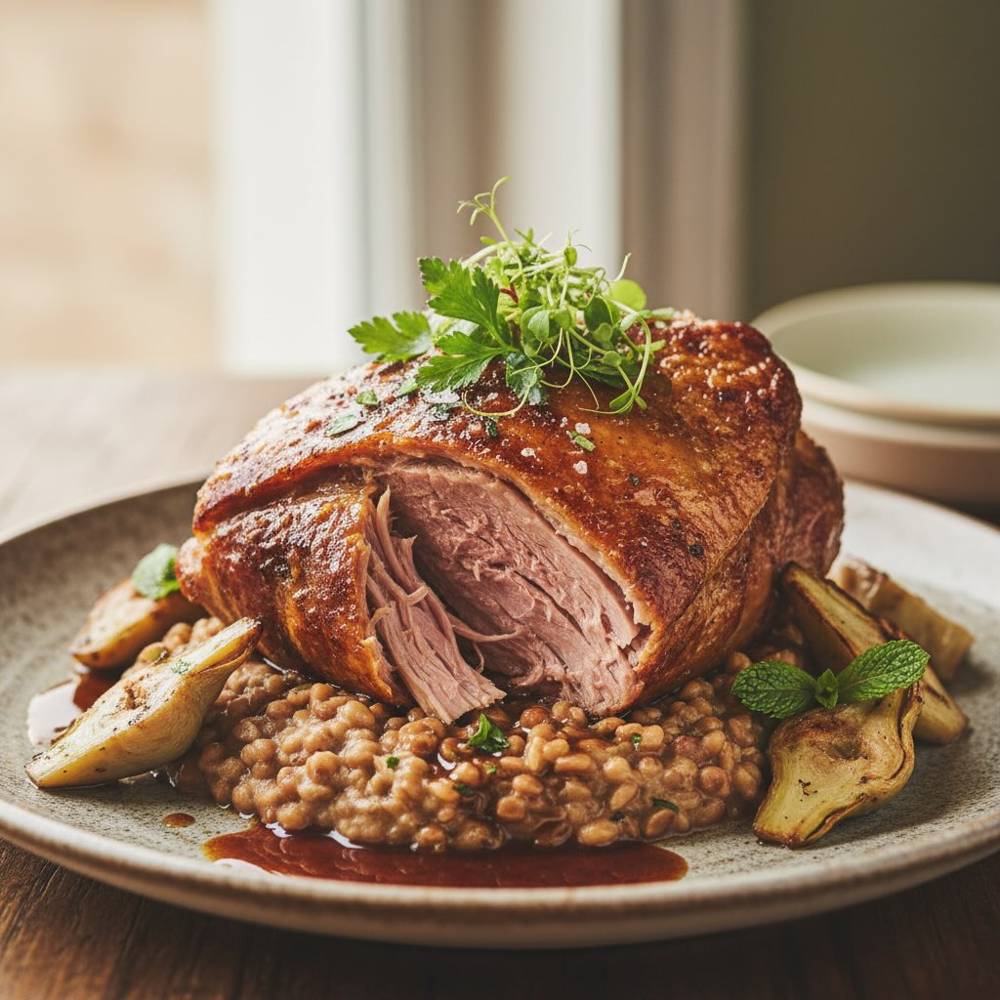

# Agnello Brasato alla Romana con Roveja Cremosa e Carciofi Novello #leguminando #

Agnello Brasato alla Romana con Roveja Cremosa e Carciofi Novello #leguminando ### 🛒 Ingredienti (4 persone) - 800g spalla o cosciotto di agnello - 200g roveja precotta - 4 carciofi novello - 1 bicchiere vino bianco - Rosmarino, aglio, olio EVO - Brodo vegetale q.b. Agnello tenero che si sfilaccia, crema vellutata di roveja e carciofi novello brasati. Un secondo pasquale che unisce tradizione contadina e eleganza.

---

*Ricetta da @leguminando*
