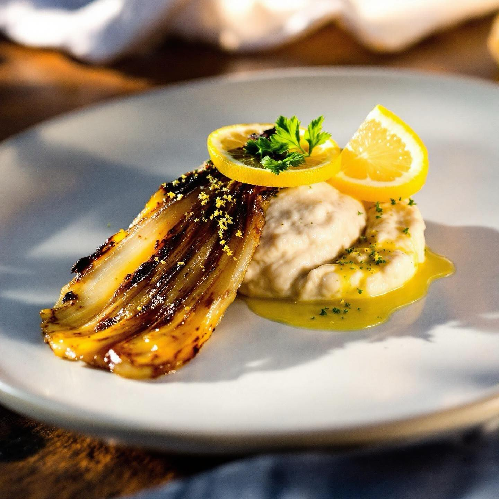

# Brasato di finocchio, Crema di fagioli e limone (4 persone) Ingredienti - 4 fino

Brasato di finocchio, Crema di fagioli e limone (4 persone) Ingredienti - 4 finocchi medi - 200 g di fagioli cannellini lessati - 1 cipolla piccola - 2 spicchi d’aglio - Scorza e succo di 1 limone - 3 cucchiai di olio EVO - Brodo vegetale q.b. (4–5 cucchiai) - Cimette verdi del finocchio tritate - Sale, pepe Preparazione 1. Taglia i finocchi a spicchi, conserva e trita le cimette verdi. 2. In padella scalda 2 cucchiai d’olio, tosta i finocchi 3–4 minuti per lato. Sala, pepa e metti da parte. 3. Nella stessa padella, rosola cipolla affettata e aglio in 1 cucchiaio d’olio finché trasparenti. 4. Rimetti i finocchi, aggiungi i fagioli, scorza e succo di limone. Versa il brodo, copri e cuoci a fuoco basso 12 min. 5. Scopri, unisci le cimette, regola di sale e pepe. Servi tiepido, con pane tostato.

---

*Ricetta da @leguminando*
