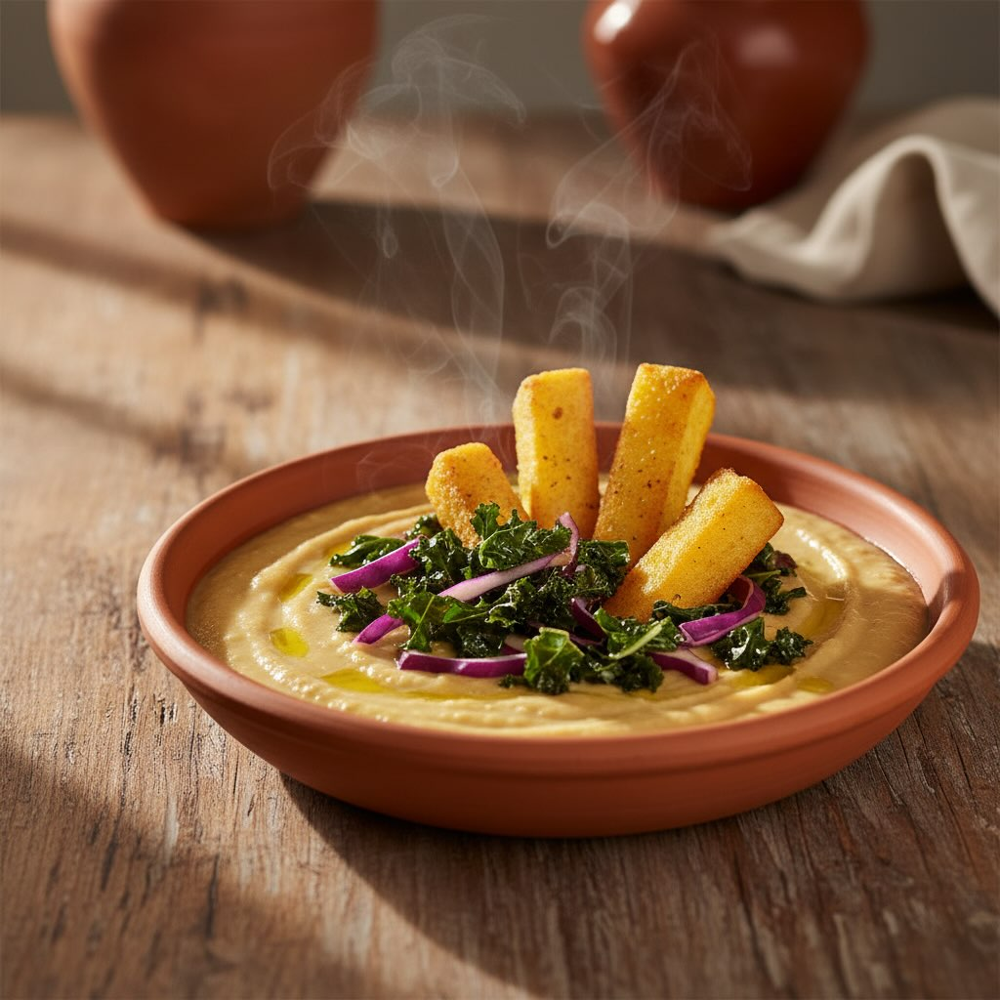

# ### Crema di Ceci - **Ingredienti:** - 400 g di ceci precotti (o 200 g secchi am

### Crema di Ceci - **Ingredienti:** - 400 g di ceci precotti (o 200 g secchi ammollati) - 1 cipolla dorata - 2 spicchi d’aglio - 1L di brodo vegetale caldo - 4 cucchiai di olio EVO - 1 rametto di rosmarino - Sale, pepe, paprika dolce q.b. - **Procedimento:** 1. Tritare cipolla e aglio. 2. Rosolare in olio EVO con il rosmarino finché la cipolla è trasparente. 3. Aggiungere i ceci e il brodo vegetale. 4. Cuocere a fuoco medio per 20 minuti. 5. Rimuovere il rosmarino e frullare fino a ottenere una crema liscia. 6. Condire con sale, pepe e paprika dolce. ## Cavoli Saltati - **Ingredienti:** - 150 g di cavolo cappuccio - 100 g di cavolo nero - 2 cucchiai di olio EVO - 1 spicchio d’aglio - Peperoncino fresco q.b. - Sale grosso - **Procedimento:** 1. Lavare e tagliare i cavoli. 2. Scaldare olio EVO in padella con aglio e peperoncino. 3. Saltare i cavoli con un pizzico di sale grosso finché sono teneri e croccanti. Polenta Fritta - **Ingredienti:** - 300 g di polenta avanzata (o preparata istantanea e raffreddata) - Olio per friggere - Rosmarino tritato - Sale - **Procedimento:** 1. Tagliare la polenta in fette o bastoncini. 2. Friggere in olio caldo finché dorata e croccante. 3. Scolare e cospargere con rosmarino tritato e sale. Assemblaggio 1. Versare la crema di ceci in ciotole. 2. Aggiungere i cavoli saltati sopra. 3. Servire con polenta fritta a lato.

---

*Ricetta da @leguminando*
