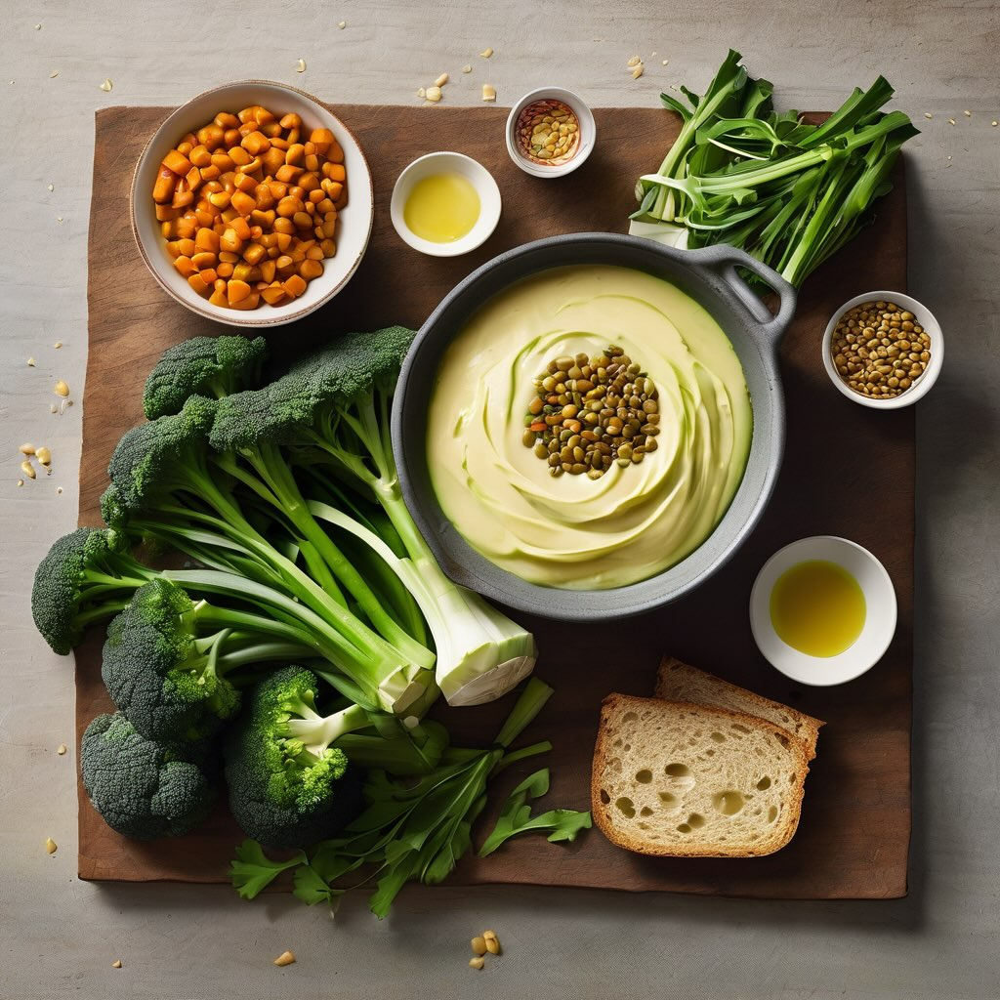

# ### Crema di Lenticchie, Porri e Cime di Rapa ## Ingredienti - 300 g di lenticch

### Crema di Lenticchie, Porri e Cime di Rapa ## Ingredienti - 300 g di lenticchie già cotte (o in scatola, scolate e risciacquate) - 2 porri (solo la parte bianca) - 300 g di cime di rapa pulite - 1 cipolla piccola - 2 spicchi d&#039;a’lio - 1 patata media - 1 l di brodo vegetale caldo - 4 cucchiai di olio extravergine d’oliva - Sale e pepe q.b. - Peperoncino in fiocchi (facoltativo) - Crostini di pane per servire Procedimento 1. **Preparazione delle Verdure** - Mondate le cime di rapa, eliminando i gambi duri, e lavatele bene. - Pulite i porri, rimuovete la parte verde scura e affettate sottilmente la parte bianca. - Sbucciate e tagliate a cubetti la patata. - Tritate finemente la cipolla e l&#039;aglio’ 2. **Soffritto** - In una pentola capiente, scaldate 3 cucchiai di olio a fuoco medio. - Aggiungete la cipolla e l’aglio, lasciando appassire fino a diventare trasparenti. 3. **Cottura delle Verdure** - Aggiungete i porri e i cubetti di patata, saltateli per 2–3 minuti. - Unite le cime di rapa e mescolate bene. - Versate il brodo caldo e portate a bollore. Coprite e cuocete a fuoco medio-basso per 20 minuti, finché le verdure saranno tenere. 4. **Frullatura** - Aggiungete le lenticchie cotte e mescolate. - Usando un frullatore a immersione, riducete tutto a una crema vellutata. - Aggiustate di sale e pepe. Aggiungete peperoncino se gradito. 5. **Impiattamento** - Servite la crema calda in ciotole, completando con un filo d’olio a crudo e qualche crostino di pane. Consigli - Per una nota dolce, sostituite la patata con mezza mela renetta. - Per una consistenza più morbida, aggiungete un cucchiaio di yogurt greco o formaggio spalmabile prima di servire. - Tostate semi di zucca o pinoli per un tocco croccante.

---

*Ricetta da @leguminando*
