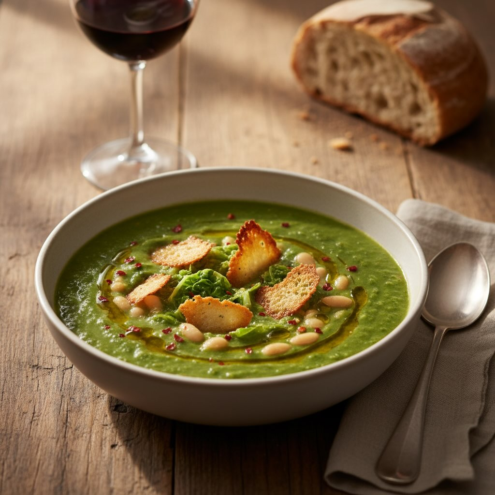

# Ingredienti - 1 cavolo verza medio (circa 800 g) - 1 cipolla bianca piccola - 2 

Ingredienti - 1 cavolo verza medio (circa 800 g) - 1 cipolla bianca piccola - 2 spicchi d’aglio - 1 peperoncino fresco (o in scaglie, a piacere) - 400 g di fagioli cannellini già cotti (in barattolo o lessati in precedenza) - 4–5 croste di parmigiano reggiano - 1 litro di brodo vegetale caldo - 2 cucchiai d’olio extravergine d’oliva - Sale e pepe nero q.b. - Olio al peperoncino (facoltativo, per servire) Preparazione 1. Pulizia delle croste di parmigiano • Elimina eventuali tracce di formaggio ammollato o residui di cera. • Passale brevemente sotto acqua corrente e asciugale con carta da cucina. 2. Cottura croccanti in forno • Preriscalda il forno a 180 °C (ventilato). • Disponi le croste sulla leccarda foderata con carta da forno, senza sovrapporle. • Cuoci 8–10 minuti finché acquistano un bel colore dorato e diventano croccanti. • Sforna e tieni da parte, si induriranno ulteriormente raffreddandosi. 3. Preparazione della crema di verza • Mondate la verza: eliminate le foglie esterne più rovinate, tagliate la costa centrale più dura e affettate le foglie a striscioline spesse circa 1 cm. • Tritate finemente la cipolla e l’aglio. Se preferite un tocco più intenso, lasciate intero uno spicchio d’aglio e rimuovetelo prima di frullare. • In una pentola capiente, scaldate l’olio con il peperoncino sminuzzato. Fate soffriggere cipolla e aglio a fiamma dolce per 4–5 minuti, finché diventano trasparenti. • Aggiungete la verza, alzate leggermente il fuoco e mescolate. Lasciate insaporire un paio di minuti, poi versate metà del brodo caldo. Coprite e fate cuocere 10–12 minuti finché la verza è tenera. • Versate il resto del brodo, salate e pepate. Con un frullatore a immersione riducete tutto in crema liscia e vellutata. Se risultasse troppo densa, aggiungete un filo di brodo o acqua calda.

---

*Ricetta da @leguminando*
