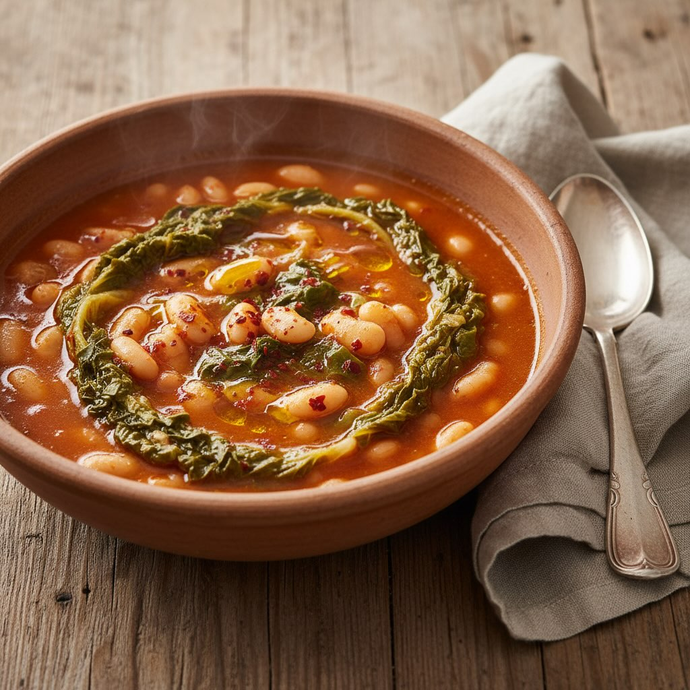

# **Ingredienti:** - 1 cespo di scarola - 600 g di fagioli borlotti freschi o cann

**Ingredienti:** - 1 cespo di scarola - 600 g di fagioli borlotti freschi o cannellini - 2 spicchi d’aglio - 1 foglia di alloro - 1 cucchiaio di triplo concentrato di pomodoro - Olio extravergine di oliva - Peperoncino a piacere - Sale e pepe q.b. **Preparazione:** 1. **Preparazione dei fagioli:** - Sciacqua i fagioli sotto acqua corrente. Se utilizzi fagioli secchi, mettili in ammollo in acqua fredda per almeno 8 ore o tutta la notte. - Scola i fagioli e mettili in una pentola con abbondante acqua fresca, aggiungi la foglia di alloro e cuoci a fuoco basso finché non diventano teneri. Scola e metti da parte. 2. **Preparazione della scarola:** - Lava accuratamente la scarola sotto acqua corrente per eliminare eventuali residui di terra. Tagliala a pezzi grossolani. 3. **Preparazione del soffritto:** - In una pentola capiente, versa un filo d’olio extravergine di oliva e fai rosolare gli spicchi d’aglio interi (puoi rimuoverli in seguito se non gradisci il sapore troppo intenso). - Aggiungi il peperoncino e lascia insaporire per un minuto. 4. **Unione degli ingredienti:** - Aggiungi il concentrato di pomodoro e mescola bene. - Unisci i fagioli scolati e la scarola. Copri il tutto con acqua calda (o brodo vegetale se preferisci) fino a coprire bene gli ingredienti. - Porta a bollore, quindi riduci la fiamma e lascia cuocere a fuoco lento per circa 30 minuti, mescolando di tanto in tanto. 5. **Aggiustamenti finali:** - Aggiusta di sale e pepe a piacere. - Se la minestra risulta troppo densa, puoi aggiungere un po’ d’acqua calda per raggiungere la consistenza desiderata.

---

*Ricetta da @leguminando*
