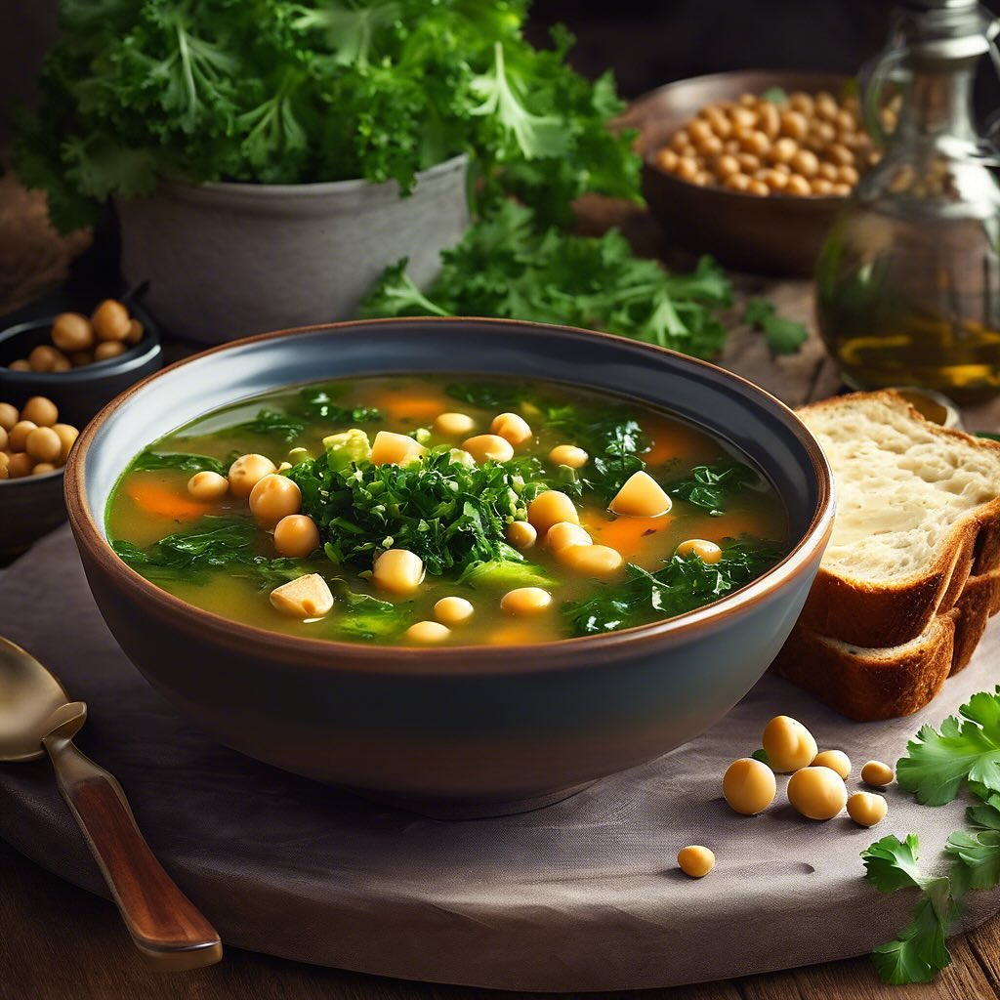

# #### Ingredienti: - 200 g di cavolo nero, lavato e tagliato a strisce - 100 g di

#### Ingredienti: - 200 g di cavolo nero, lavato e tagliato a strisce - 100 g di cavolo verza, lavato e tagliato a strisce - 150 g di fagioli (già cotti o in scatola) - 150 g di lenticchie (già cotte o in scatola) - 150 g di ceci (già cotti o in scatola) - 200 g di pane raffermo (di 15 giorni), tagliato a cubetti - 1 cipolla, tritata - 2 spicchi d’aglio, tritati - 1 litro di brodo vegetale - 2 cucchiai di olio d’oliva - Sale e pepe q.b. - Peperoncino (facoltativo) - Prezzemolo fresco per guarnire #### Procedimento: 1. **Soffritto**: In una grande pentola, scalda l’olio d’oliva su fuoco medio. Aggiungi la cipolla e l’aglio, e soffriggi fino a quando la cipolla diventa traslucida. 2. **Aggiunta dei Cavoli**: Unisci il cavolo nero e il cavolo verza. Cuoci per circa 5-7 minuti, mescolando di tanto in tanto, fino a quando i cavoli iniziano ad appassire. 3. **Legumi e Brodo**: Aggiungi i fagioli, le lenticchie e i ceci nella pentola. Versa il brodo vegetale e porta a ebollizione. Riduci il fuoco e lascia sobbollire per circa 20-25 minuti. 4. **Pane Raffermo**: Aggiungi i cubetti di pane raffermo alla minestra e mescola bene. Lascia cuocere per altri 10 minuti, in modo che il pane si ammorbidisca e assorba i sapori. 5. **Condimenti**: Regola di sale e pepe. Se ti piace un po’ di piccante, aggiungi peperoncino a piacere. 6. **Servire**: Una volta che la minestra è pronta, servila calda in ciotole e guarnisci con prezzemolo fresco tritato. ### Consigli: - Puoi personalizzare la ricetta aggiungendo altre verdure di stagione. - Se preferisci una minestra più cremosa, frulla una parte della minestra e poi mescola nuovamente.

---

*Ricetta da @leguminando*
