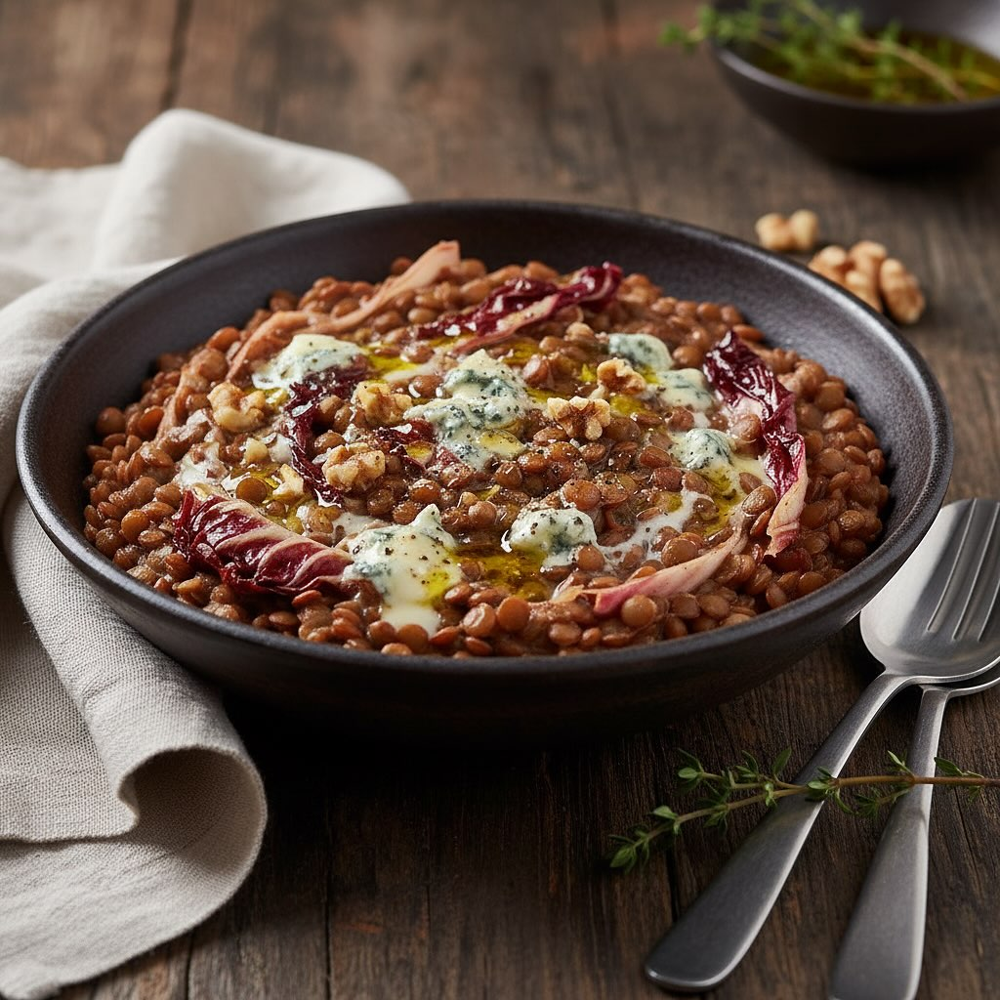

# ### Ingredienti: - 200 g di lenticchie - 150 g di gorgonzola - 1 cespo di radicc

### Ingredienti: - 200 g di lenticchie - 150 g di gorgonzola - 1 cespo di radicchio rosso - 1 cipolla - 2 cucchiai di olio d’oliva - 1 spicchio d’aglio - Sale e pepe q.b. - Brodo vegetale q.b. - Noci tritate (opzionale) ### Procedimento: 1. **Preparazione delle Lenticchie**: - Sciacqua le lenticchie sotto acqua corrente e scolale. - In una pentola, versa le lenticchie e coprile con il brodo vegetale. Porta a ebollizione e cuoci a fuoco lento per circa 25-30 minuti, finché non saranno tenere. Scola e tieni da parte. 2. **Preparazione del Radicchio**: - Lava il radicchio e taglialo a striscioline. - In una padella, scalda un cucchiaio di olio d’oliva e aggiungi l’aglio tritato. Quando l’aglio sarà dorato, aggiungi il radicchio e saltalo per 5-7 minuti finché non sarà appassito. Togli l’aglio e tieni da parte. 3. **Cottura della Cipolla**: - Nella stessa padella, aggiungi un altro cucchiaio di olio e la cipolla tritata finemente. Soffriggi fino a che diventa trasparente. 4. **Assemblaggio del Piatto**: - Aggiungi le lenticchie cotte alla padella con la cipolla e mescola bene. - Unisci il radicchio appassito e mescola. - Spezzetta il gorgonzola e aggiungilo al composto, mescolando fino a che non si scioglie leggermente, creando una crema. 5. **Condimento**: - Aggiusta di sale e pepe secondo il tuo gusto. - Se lo desideri, aggiungi delle noci tritate per un tocco croccante.

---

*Ricetta da @leguminando*
