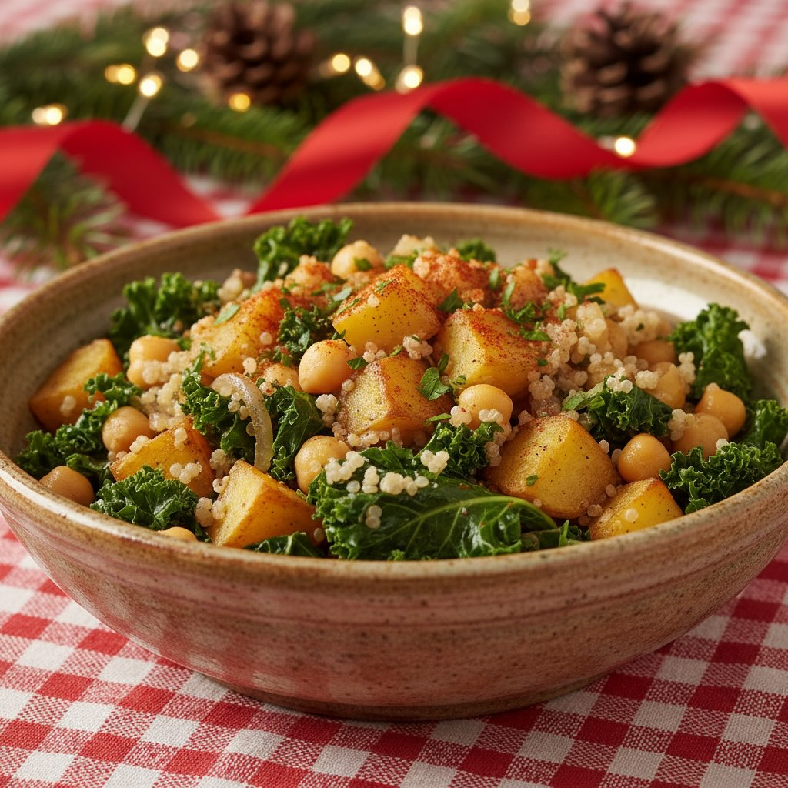

# ### Ingredienti - 200 g di quinoa - 2 patate medie, pelate e tagliate a cubetti 

### Ingredienti - 200 g di quinoa - 2 patate medie, pelate e tagliate a cubetti - 200 g di cavolo nero, lavato e tagliato a strisce - 150 g di cicerchie, ammollate e cotte - 1 cipolla, tritata - 2 spicchi d’aglio, tritati - 2 cucchiai di olio d’oliva - 1 cucchiaino di paprika dolce - Sale e pepe q.b. - Brodo vegetale (circa 500 ml) - Succo di mezzo limone - Prezzemolo fresco tritato per guarnire ## Preparazione 1. **Preparazione della quinoa**: Sciacqua la quinoa sotto acqua corrente. Cuocila in una pentola con 400 ml di acqua e un pizzico di sale. Porta ad ebollizione, poi abbassa la fiamma e lascia cuocere coperta per circa 15 minuti, finché l&#039;’cqua è assorbita. 2. **Cottura delle verdure**: In una padella grande, scalda l&#039;’lio d&#039;’liva a fuoco medio. Aggiungi la cipolla e l&#039;’glio, e soffriggi finché sono dorati. 3. **Aggiunta delle patate**: Unisci le patate a cubetti alla padella. Mescola bene e cuoci per circa 5 minuti, aggiungendo un po’ di brodo vegetale se necessario per evitare che si attacchino. 4. **Cottura del cavolo nero**: Aggiungi il cavolo nero, mescola e copri la padella. Cuoci per altri 5 minuti. 5. **Completamento del piatto**: Incorpora le cicerchie cotte, la quinoa e la paprika. Mescola bene tutti gli ingredienti e aggiusta di sale e pepe.

---

*Ricetta da @leguminando*
