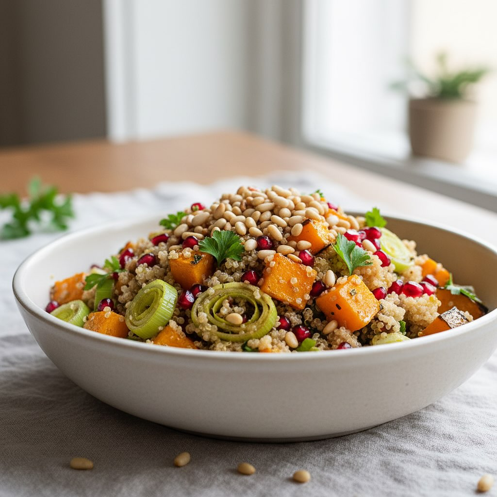

# Ingredienti - 200 g quinoa, sciacquata - 400 ml acqua o brodo - 400 g zucca a cu

Ingredienti - 200 g quinoa, sciacquata - 400 ml acqua o brodo - 400 g zucca a cubetti - 100 g di fagioli - 2 porri (solo parte bianca), affettati - 1 melograno (o 120 g chicchi) - 30–40 g pinoli o noci tostate - 3 cucchiai olio evo - 1/2 limone (succo) - 1 cucchiaino paprika dolce (opzionale) - Sale, pepe, prezzemolo tritato (opzionale) Procedimento 1. Cuocere la quinoa in acqua/brodo salato 12–15 min, sgranare e tenere coperta. 2. Preriscaldare il forno a 200°C. Condire la zucca con 1–2 cucchiai d’olio, paprika, sale e cuocere 20–30 min fino a doratura. 3. Saltare i porri in 1 cucchiaio d’olio 6–8 min finché morbidi; salare. 4. Tostare i pinoli in padella 2–3 min. 5. Mescolare quinoa tiepida, zucca, porri, chicchi di melograno e pinoli. Condire con succo di limone, olio, sale e pepe. 6. Guarnire con prezzemolo e servire tiepida o a temperatura ambiente.

---

*Ricetta da @leguminando*
