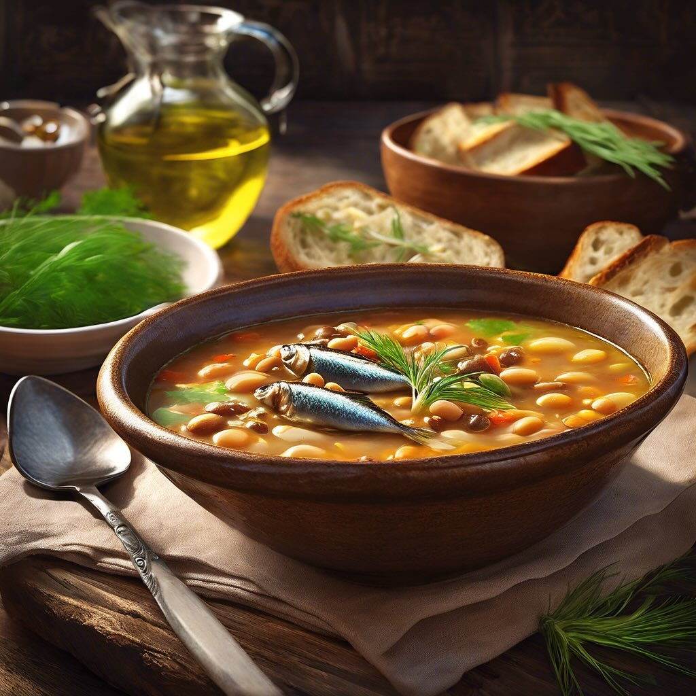

# ## Ingredienti: - 250 g di fagioli borlotti secchi - 4 filetti di sarde sott’oli

## Ingredienti: - 250 g di fagioli borlotti secchi - 4 filetti di sarde sott’olio - 1 cipolla - 2 spicchi d’aglio - 1 gambo di sedano - 1 carota - 1 pomodoro maturo - 1 mazzetto di finocchietto selvatico - 1 litro di brodo vegetale - Olio extravergine d’oliva - Sale e pepe q.b. - Peperoncino (facoltativo) ### Preparazione: 1. **Preparazione dei fagioli**: Metti i fagioli borlotti in ammollo in abbondante acqua fredda per almeno 8 ore o per tutta la notte. Dopo l’ammollo, scolali e risciacquali. 2. **Soffritto**: In una pentola capiente, scalda un po’ di olio extravergine d’oliva e aggiungi la cipolla tritata, gli spicchi d’aglio schiacciati, il sedano e la carota tagliati a pezzetti. Fai soffriggere a fuoco medio finché le verdure diventano morbide. 3. **Aggiunta dei fagioli e del brodo**: Unisci i fagioli scolati al soffritto e mescola bene. Aggiungi il pomodoro tagliato a cubetti e versa il brodo vegetale. Porta a ebollizione, poi riduci la fiamma e lascia cuocere a fuoco lento per circa 1-1,5 ore, finché i fagioli sono teneri. Se necessario, aggiungi altra acqua calda durante la cottura. 4. **Aggiunta delle sarde**: A circa 10 minuti dalla fine della cottura, aggiungi i filetti di sarde spezzettati e il finocchietto selvatico tritato. Mescola bene e aggiusta di sale e pepe a piacere. Se gradisci un po’ di piccante, aggiungi un pizzico di peperoncino. 5. **Servizio**: Servi la zuppa calda, con un filo d’olio extravergine d’oliva a crudo e, se ti piace, accompagnata da crostini di pane tostato.

---

*Ricetta da @leguminando*
