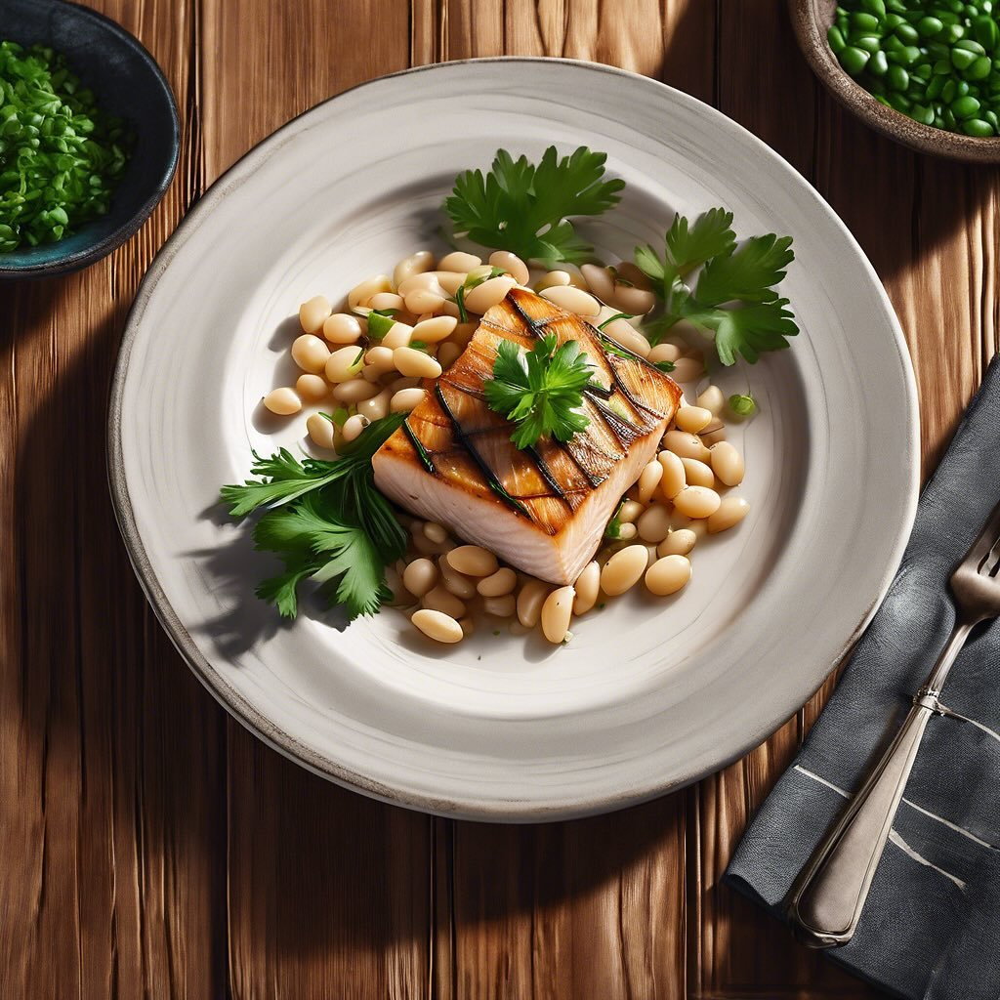

# # Ingredienti: - 250 g di fagioli cannellini (già lessati o in scatola) - 200 g 

# Ingredienti: - 250 g di fagioli cannellini (già lessati o in scatola) - 200 g di pesce spada affumicato a tranci - 1 cipolla rossa - 2 spicchi d’aglio - 1 pomodoro maturo (o 200 g di pomodori pelati) - 4 cucchiai di olio extravergine d’oliva - Prezzemolo fresco q.b. - Sale e pepe q.b. - Succo di limone (facoltativo) ### Procedimento: 1. **Preparazione delle verdure**: Trita finemente la cipolla e l’aglio. Se usi un pomodoro fresco, pelalo e taglialo a cubetti. 2. **Soffritto**: In una padella grande, scalda l’olio d’oliva e aggiungi la cipolla e l’aglio. Fai soffriggere a fuoco medio finché la cipolla non diventa trasparente. 3. **Aggiunta del pomodoro**: Unisci il pomodoro a cubetti (o i pomodori pelati) e cuoci per circa 5-7 minuti, finché il pomodoro si ammorbidisce. 4. **Unione dei fagioli**: Aggiungi i fagioli cannellini nella padella. Mescola bene e lascia insaporire per qualche minuto. Se necessario, aggiungi un po’ di brodo vegetale o acqua per mantenere il tutto umido. 5. **Cottura del pesce spada**: Taglia il pesce spada affumicato a strisce e aggiungilo nella padella. Mescola delicatamente per non rompere i fagioli e cuoci per altri 5 minuti, giusto il tempo di scaldare il pesce. 6. **Aggiustare di sapore**: Regola di sale e pepe a piacere. Se vuoi, puoi aggiungere un po’ di succo di limone per un tocco di freschezza. 7. **Servizio**: Servi i fagioli con pesce spada affumicato caldi, guarnendo con prezzemolo fresco tritato.

---

*Ricetta da @leguminando*
