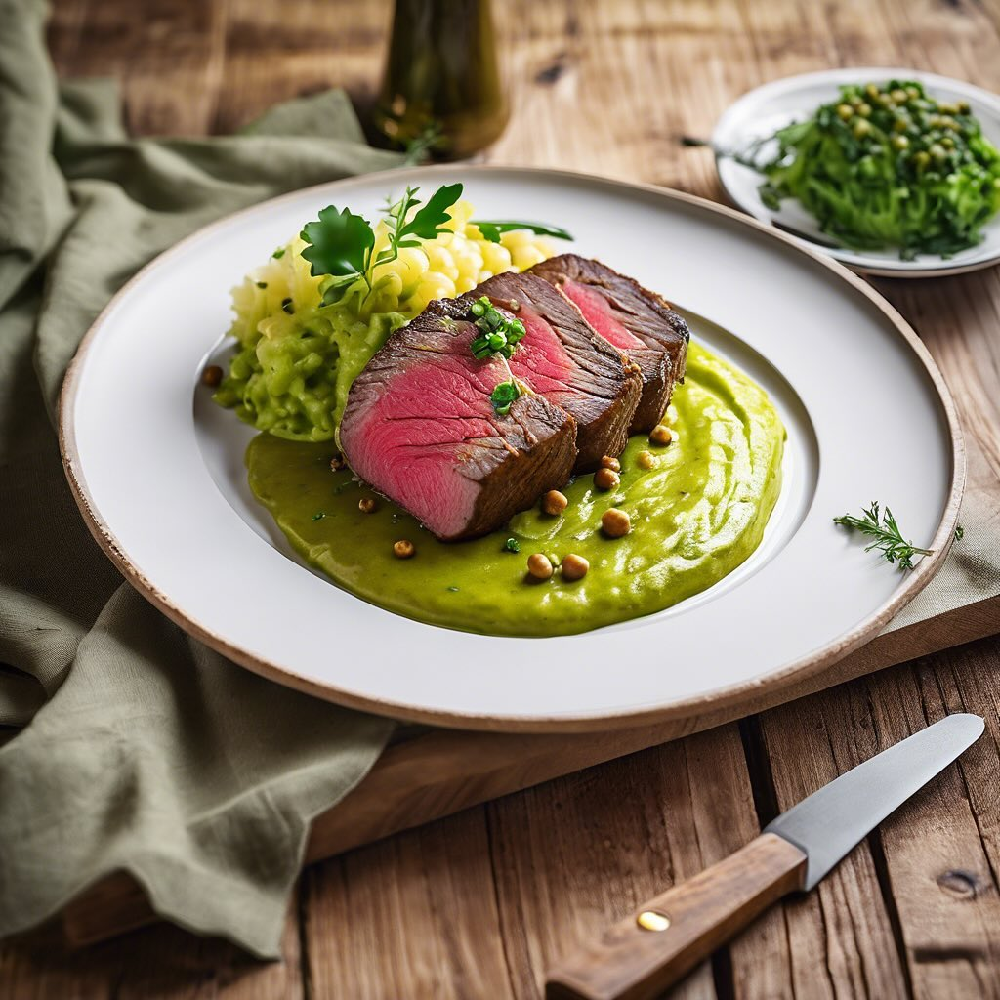

# ### Ingredienti - 250 g di farina 00 - 50 g di semola di grano duro - 1 cucchiai

### Ingredienti - 250 g di farina 00 - 50 g di semola di grano duro - 1 cucchiaino di curcuma in polvere - 50 g di olive nere (denocciolate e tritate) - 30 g di semi di zucca - 1 cucchiaino di sale - 1 cucchiaio di olio extravergine d’oliva - 125 ml di acqua tiepida - 1/2 cucchiaino di lievito di birra secco (facoltativo) ### Procedimento 1. **Preparazione dell’impasto**: In una ciotola, mescola la farina, la semola, la curcuma, il sale e il lievito (se usato). Aggiungi le olive tritate e i semi di zucca. 2. **Aggiunta dei liquidi**: Fai un buco al centro delle polveri e versa l’olio d’oliva e l’acqua tiepida. Inizia a mescolare con un cucchiaio fino a ottenere un impasto. 3. **Lavorazione**: Trasferisci l’impasto su una superficie infarinata e lavoralo per circa 5-10 minuti, fino a quando diventa liscio ed elastico. 4. **Lievitazione**: Forma una palla con l’impasto e mettila in una ciotola leggermente unta. Copri con un panno e lascia lievitare in un luogo caldo per circa 1 ora, o fino al raddoppio del volume. 5. **Formazione dei grissini**: Dopo la lievitazione, stendi l’impasto su una superficie infarinata fino a ottenere uno spessore di circa 5 mm. Taglia delle strisce di circa 1 cm di larghezza e allunga ciascuna striscia con le mani. 6. **Cottura**: Disponi i grissini su una teglia rivestita di carta da forno e inforna a 180°C per circa 15-20 minuti, o fino a quando saranno dorati e croccanti. 7. **Raffreddamento**: Sforna i grissini e lasciali raffreddare su una griglia. ### Servizio Servili come antipasto o snack, ottimi da accompagnare con formaggi o salse.

---

*Ricetta da @leguminando*
