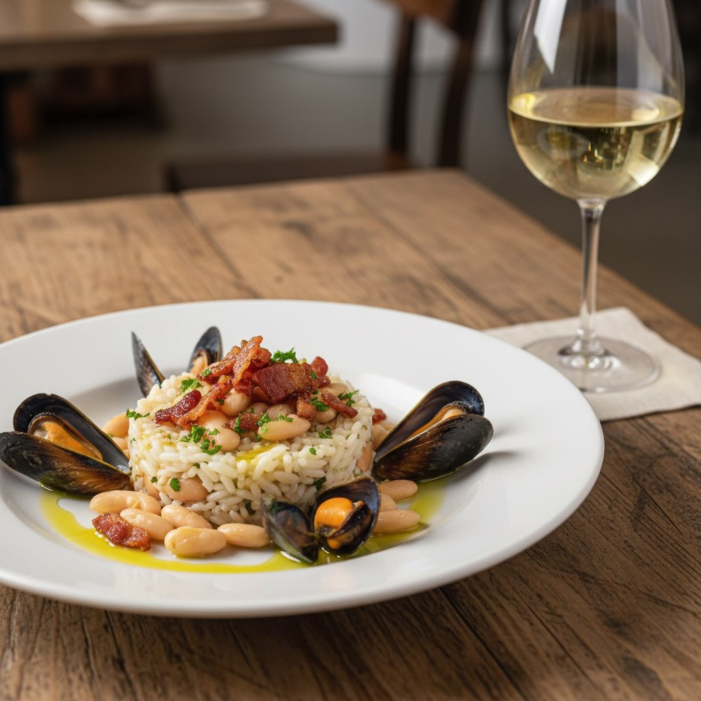

# ### Ingredienti - **250 g di riso Arborio** - **400 g di cozze fresche** - **150

### Ingredienti - **250 g di riso Arborio** - **400 g di cozze fresche** - **150 g di pancetta affumicata a cubetti** - **200 g di fagioli cannellini cotti** - **1 cipolla tritata finemente** - **2 spicchi d’aglio** - **1 peperoncino rosso (opzionale)** - **Olio d’oliva extra vergine** - **500 ml di brodo di pesce** - **100 ml di vino bianco** - **Prezzemolo fresco tritato** - **Sale e pepe q.b.** ## Procedimento 1. **Preparazione delle cozze:** - Pulisci bene le cozze sotto l&#039;’cqua corrente, eliminando le barbe e le incrostazioni dai gusci. - In una padella capiente, scalda un filo d&#039;’lio e aggiungi uno spicchio d&#039;’glio. Aggiungi le cozze e sfuma con il vino bianco. Copri e cuoci a fuoco medio finché le cozze non si aprono. Togli le cozze dalla padella, filtrando il liquido di cottura per eliminarne le impurità. 2. **Cottura del riso:** - In un&#039;’ltra padella, scalda un po&#039;’d’olio e aggiungi la cipolla tritata e il peperoncino. Soffriggi fino a quando la cipolla diventa trasparente. - Aggiungi la pancetta e cuoci fino a quando è dorata. - Unisci il riso e tostalo per un paio di minuti, mescolando bene. 3. **Aggiunta degli ingredienti:** - Versa il brodo di pesce caldo al riso un mestolo alla volta, mescolando continuamente. Aggiungi il liquido di cottura delle cozze filtrato. - A metà cottura, aggiungi i fagioli cannellini e mescola bene. 4. **Assemblaggio finale:** - Quando il riso è quasi cotto, unisci le cozze aperte (alcune senza guscio) e aggiusta di sale e pepe. - Continua a cuocere fino a quando il riso è cremoso ma al dente.

---

*Ricetta da @leguminando*
