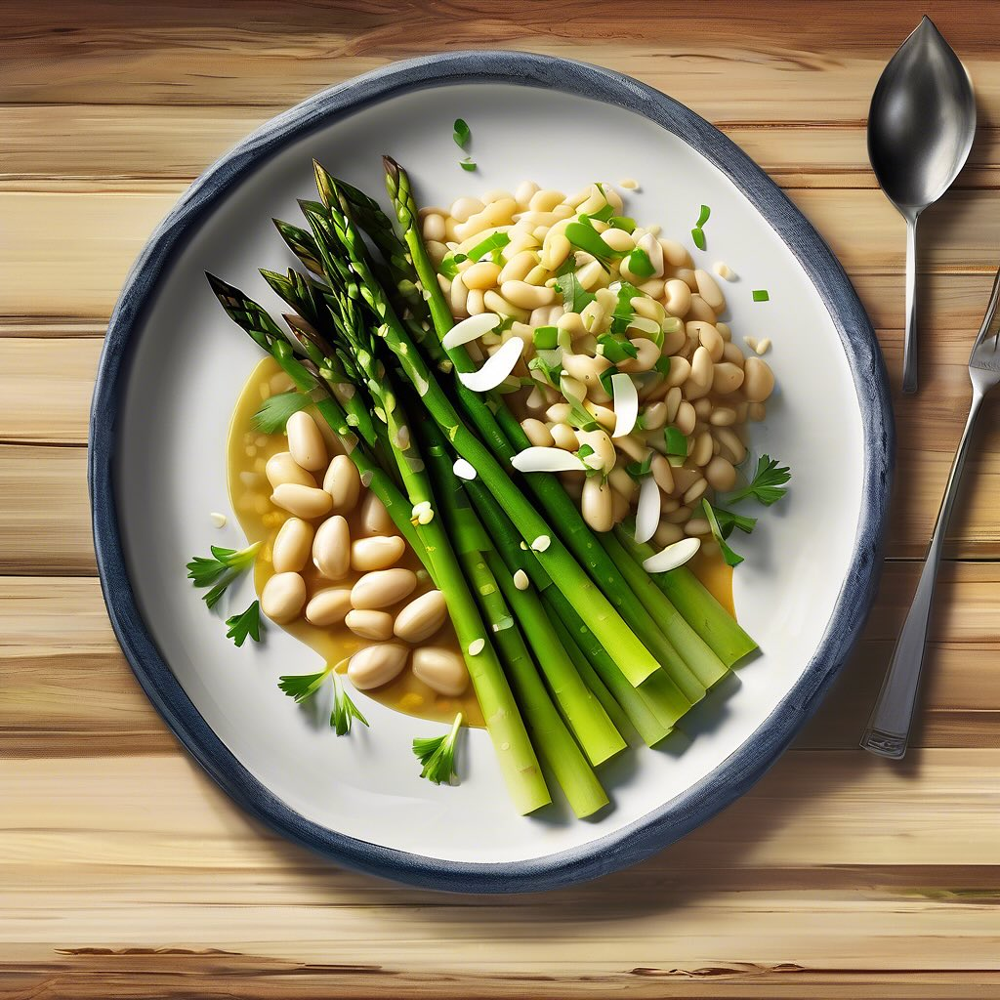

# ### Ingredienti - 300 g di cavolo cappuccio - 200 g di ceci lessati - 150 g di a

### Ingredienti - 300 g di cavolo cappuccio - 200 g di ceci lessati - 150 g di asparagi - 4 foglie di cavolo verza - 1 cipolla - 2 spicchi d’aglio - 500 ml di brodo vegetale - 50 ml di olio extravergine d’oliva - Sale e pepe q.b. - Semi di sesamo (per decorare) ### Procedimento 1. **Preparazione della crema**: In una pentola, scalda un po’ d’olio e soffriggi la cipolla tritata e l’aglio fino a doratura. Aggiungi il cavolo cappuccio tagliato a strisce e fai cuocere per circa 5 minuti, mescolando di tanto in tanto. 2. **Cottura**: Versa il brodo vegetale nella pentola e porta a ebollizione. Aggiungi i ceci lessati e lascia cuocere per circa 15-20 minuti finché il cavolo non sarà tenero. 3. **Frullare**: Utilizza un frullatore a immersione per ridurre il tutto in una crema liscia. Aggiusta di sale e pepe. 4. **Preparazione degli asparagi**: Nel frattempo, taglia gli asparagi e saltali in padella con un filo d’olio fino a renderli teneri ma croccanti. 5. **Scottare le foglie di cavolo verza**: Porta a ebollizione acqua salata e scotta le foglie di cavolo verza per un paio di minuti. Scolale e raffreddale in acqua ghiacciata. 6. **Impiattamento**: Versa la crema di cavolo cappuccio nei piatti, adagia sopra gli asparagi saltati e le foglie di cavolo verza. Completa con un filo d’olio e una spolverata di semi di sesamo.

---

*Ricetta da @leguminando*
