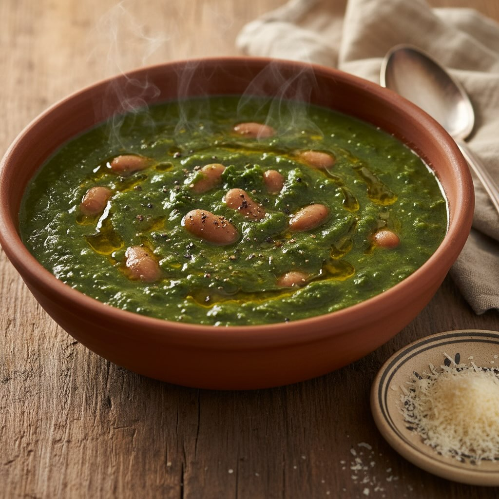

# ### Ingredienti - 300 g di cavolo nero - 250 g di patate - 200 g di fagioli borl

### Ingredienti - 300 g di cavolo nero - 250 g di patate - 200 g di fagioli borlotti già cotti (anche in scatola) - 1 cipolla - 2 spicchi d’aglio - 1 litro di brodo vegetale - 2 cucchiai di olio extravergine d’oliva - Sale e pepe q.b. - Parmigiano Reggiano grattugiato (opzionale) ## Istruzioni 1. **Preparazione degli ingredienti** - Lava bene il cavolo nero, rimuovi la parte centrale dura e taglialo a striscioline. - Sbuccia le patate e tagliale a cubetti. - Affetta finemente la cipolla e trita l&#039;’glio. 2. **Soffritto** - In una pentola capiente, scalda l&#039;’lio extravergine d&#039;’liva. - Aggiungi la cipolla e l’aglio, e soffriggi a fuoco medio fino a quando la cipolla diventa trasparente. 3. **Cottura delle verdure** - Aggiungi le patate e il cavolo nero nella pentola e mescola bene. - Versa il brodo vegetale e porta a ebollizione. - Riduci il fuoco e lascia cuocere per circa 20-25 minuti, fino a quando le patate sono morbide. 4. **Aggiunta dei fagioli** - Aggiungi i fagioli borlotti e continua la cottura per altri 5 minuti. 5. **Frullare** - Usa un frullatore a immersione per frullare la zuppa fino a ottenere una consistenza cremosa. Se preferisci, puoi lasciare qualche pezzo di verdura intero. 6. **Condimento** - Regola di sale e pepe secondo il tuo gusto. - Se lo desideri, aggiungi del Parmigiano Reggiano grattugiato prima di servire.

---

*Ricetta da @leguminando*
