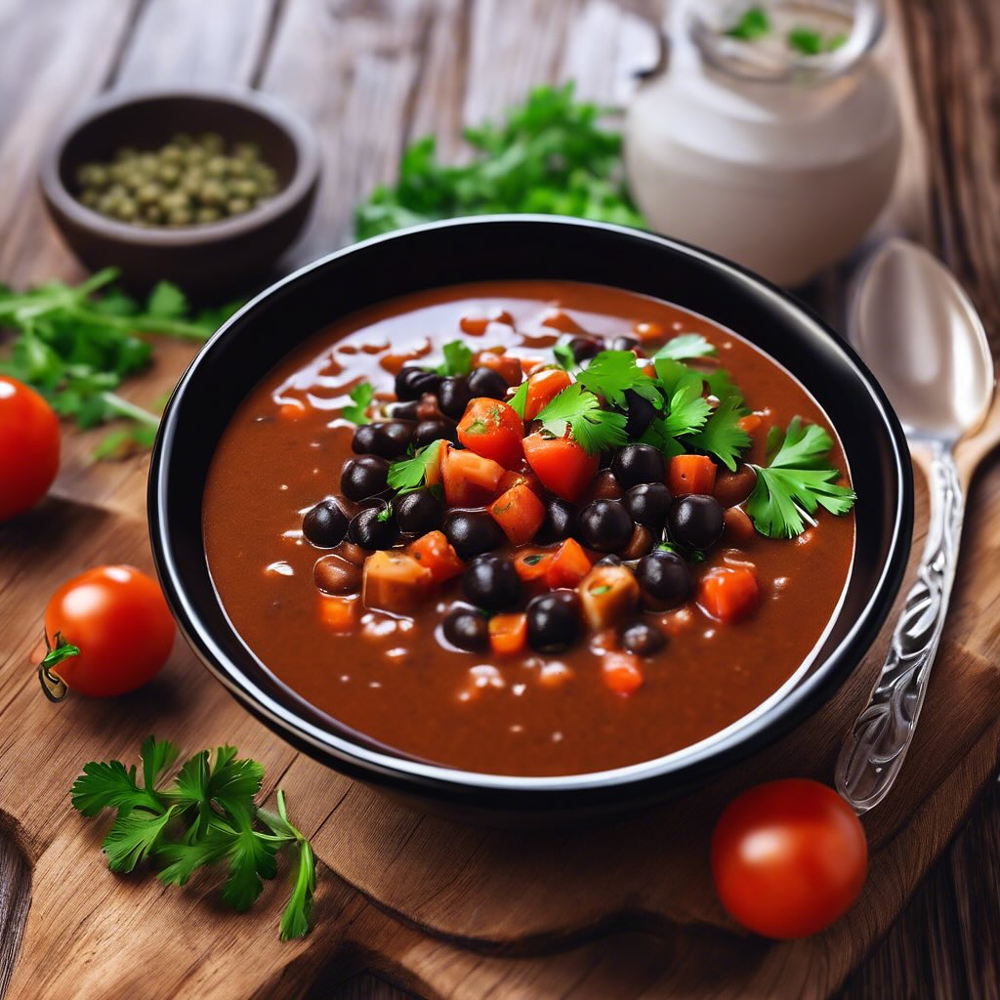

# #### Ingredienti: - 300 g di fagioli (borlotti o cannellini, secchi o in scatola

#### Ingredienti: - 300 g di fagioli (borlotti o cannellini, secchi o in scatola) - 1 cespo di scarola - 1 cipolla - 2 spicchi d’aglio - 4 cucchiai di olio d’oliva - 1 litro di brodo vegetale (o acqua) - Sale e pepe q.b. - Peperoncino (facoltativo) - Prezzemolo fresco tritato per guarnire #### Procedimento: 1. **Preparazione dei fagioli**: Se usi fagioli secchi, mettili in ammollo per almeno 8 ore. Scolali e lessali in acqua salata per circa 1-1.5 ore, fino a quando sono teneri. Se usi fagioli in scatola, scolali e risciacquali. 2. **Preparazione della scarola**: Lava bene la scarola, rimuovi le foglie esterne danneggiate e tagliala a strisce. 3. **Soffritto**: In una pentola capiente, scalda l’olio d’oliva a fuoco medio. Aggiungi la cipolla tritata e l’aglio schiacciato. Fai soffriggere fino a quando la cipolla diventa trasparente. 4. **Cottura della scarola**: Aggiungi la scarola nella pentola e mescola bene. Cuoci per circa 5-7 minuti, finché la scarola si appassisce. 5. **Unire i fagioli**: Aggiungi i fagioli cotti (o scolati) nella pentola, insieme al brodo vegetale. Porta a ebollizione e poi riduci il fuoco, lasciando sobbollire per circa 15-20 minuti. Aggiusta di sale e pepe e, se ti piace, aggiungi un pizzico di peperoncino. 6. **Servire**: Una volta che il piatto è ben amalgamato e caldo, servi i fagioli con scarola in ciotole, guarnendo con prezzemolo fresco tritato e un filo d’olio d’oliva a crudo. ### Consigli: - Puoi servire questo piatto con crostini di pane tostato per un tocco extra. - Aggiungi un po’ di limone grattugiato per un sapore fresco.

---

*Ricetta da @leguminando*
