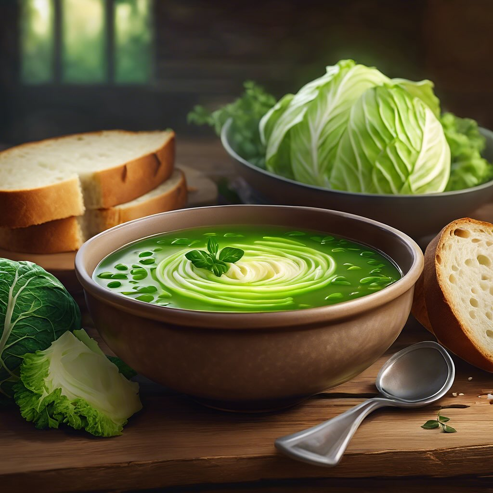

# ## Ingredienti - 300 g di fagioli cannellini (secchi o in scatola) - 200 g di ca

## Ingredienti - 300 g di fagioli cannellini (secchi o in scatola) - 200 g di cavolo nero - 2 patate medie - 2 carote - 1 cipolla - 2 spicchi d’aglio - 1 rametto di rosmarino - 1 litro di brodo vegetale - 4 cucchiai di olio extravergine d’oliva - Sale e pepe q.b. - Pane toscano raffermo ### Preparazione 1. **Preparazione dei fagioli**: Se usi fagioli secchi, mettili a bagno per almeno 8 ore e poi lessali in acqua salata fino a quando sono teneri. Se usi fagioli in scatola, scolali e risciacquali. 2. **Soffritto**: In una pentola capiente, scalda l’olio extravergine d’oliva e aggiungi la cipolla tritata, l’aglio schiacciato e le carote tagliate a rondelle. Fai soffriggere fino a quando la cipolla diventa trasparente. 3. **Aggiunta delle patate**: Sbuccia e taglia le patate a cubetti, quindi aggiungile al soffritto. Mescola bene. 4. **Cottura dei vegetali**: Aggiungi il cavolo nero tagliato a strisce e il rametto di rosmarino. Mescola e lascia insaporire per qualche minuto. 5. **Brodo**: Versa il brodo vegetale nella pentola e porta a ebollizione. Aggiungi i fagioli (cotti o in scatola) e cuoci a fuoco medio per circa 30 minuti, mescolando di tanto in tanto. 6. **Aggiustare di sale e pepe**: Quando la zuppa è pronta, aggiusta di sale e pepe secondo il tuo gusto. 7. **Servizio**: Servi la zuppa calda con fette di pane toscano raffermo, eventualmente abbrustolite. ### Consiglio Puoi arricchire la zuppa con un filo d’olio extravergine d’oliva a crudo e una spolverata di pepe nero prima di servire.

---

*Ricetta da @leguminando*
