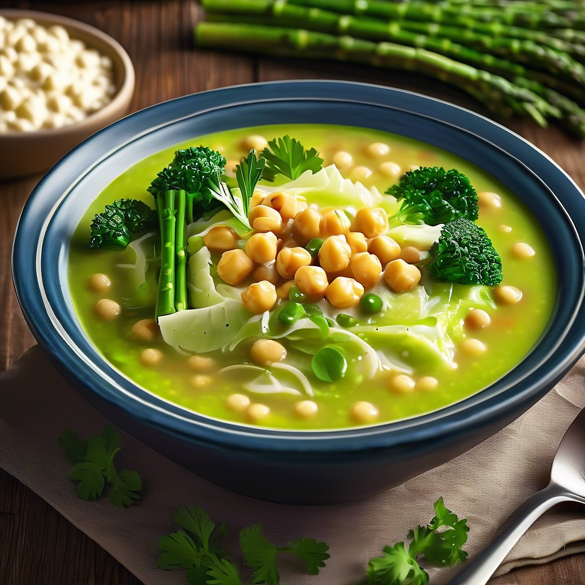

# ### Ingredienti: - 300 g di riso Arborio - 100 g di cicerchie - 100 g di fave fr

### Ingredienti: - 300 g di riso Arborio - 100 g di cicerchie - 100 g di fave fresche o surgelate - 200 g di asparagi - 1 porro - 1 litro di brodo vegetale - 1/2 bicchiere di vino bianco secco - 50 g di parmigiano grattugiato - Olio extravergine d’oliva - Sale e pepe q.b. - Erbe aromatiche (prezzemolo o basilico) per guarnire ### Procedimento: 1. **Preparazione delle cicerchie**: Se utilizzi cicerchie secche, mettile in ammollo per almeno 12 ore e lessale in acqua salata fino a quando non sono tenere. Se utilizzi cicerchie già cotte, sciacquale e mettile da parte. 2. **Pulizia degli asparagi**: Pulisci gli asparagi, eliminando la parte legnosa. Tagliali a pezzetti, conservando le punte per la decorazione. 3. **Preparazione del porro**: Affetta finemente il porro e fallo rosolare in una pentola con un filo d’olio extravergine d’oliva fino a quando diventa trasparente. 4. **Cottura del risotto**: Aggiungi il riso al porro e tostalo per un paio di minuti. Sfuma con il vino bianco e lascia evaporare. 5. **Aggiunta del brodo**: Inizia ad aggiungere il brodo vegetale, un mestolo alla volta, mescolando frequentemente. Dopo circa 10 minuti, aggiungi le cicerchie, le fave e gli asparagi (tranne le punte). 6. **Cottura finale**: Continua a cuocere il risotto per circa 10-12 minuti, fino a quando il riso è al dente. Aggiungi le punte di asparagi negli ultimi 5 minuti di cottura. 7. **Mantecatura**: Togli il risotto dal fuoco, aggiungi il parmigiano grattugiato, un filo d’olio e mescola bene. Regola di sale e pepe. 8. **Impiattamento**: Servi caldo, guarnito con erbe aromatiche fresche e qualche punta di asparago per decorare.

---

*Ricetta da @leguminando*
