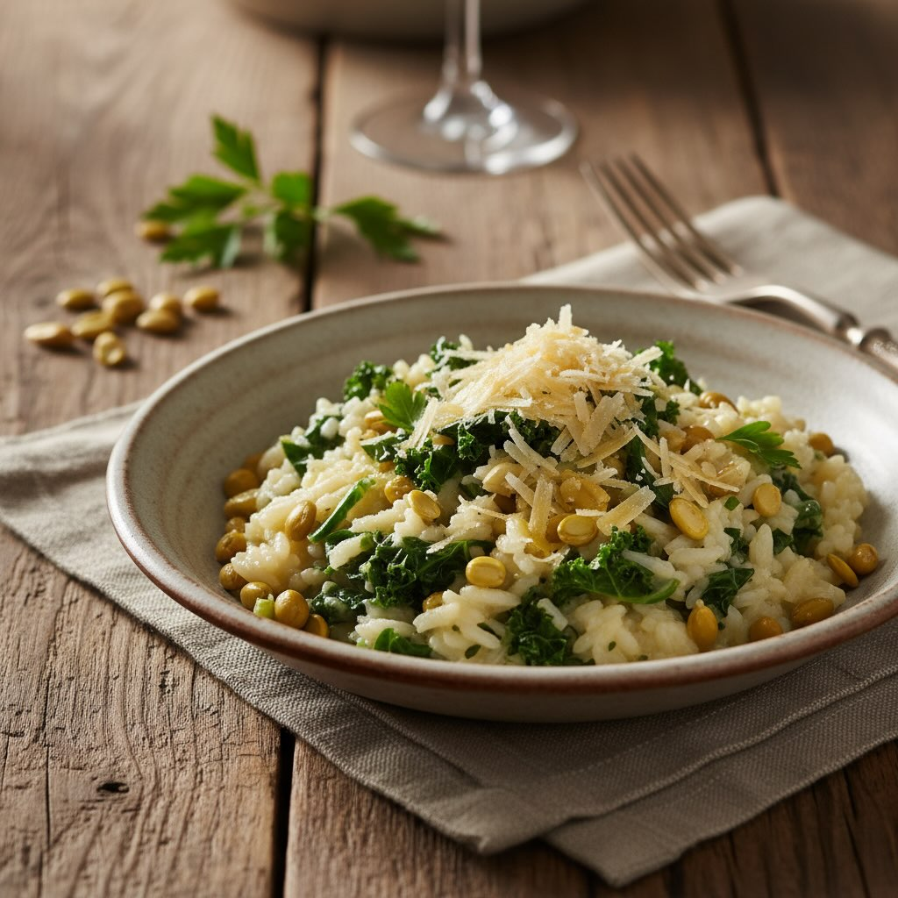

# ### Ingredienti - 300 g di riso Arborio - 200 g di cicerchie secche (o in scatol

### Ingredienti - 300 g di riso Arborio - 200 g di cicerchie secche (o in scatola) - 200 g di cavolo nero - 1 cipolla media - 2 spicchi d’aglio - 50 g di parmigiano grattugiato - 1 litro di brodo vegetale - 3 cucchiai di olio d’oliva extravergine - Sale e pepe q.b. - Qualche foglia di salvia (opzionale) ## Procedimento 1. **Preparazione delle cicerchie**: - Se usi cicerchie secche, mettile in ammollo per almeno 8 ore, poi cuocile in acqua bollente fino a quando saranno tenere. Se usi quelle in scatola, scolale e sciacquale. 2. **Preparazione del cavolo nero**: - Lava bene il cavolo nero, elimina le coste dure centrali e taglia le foglie a strisce. 3. **Soffritto**: - In una pentola capiente, scalda l&#039;’lio d&#039;’liva e aggiungi la cipolla tritata finemente e l’aglio schiacciato. Cuoci fino a quando la cipolla diventa trasparente. 4. **Cottura del riso**: - Aggiungi il riso alla pentola e tostalo per un paio di minuti, mescolando continuamente. - Versa un mestolo di brodo vegetale caldo e continua a mescolare. Aggiungi il brodo poco alla volta, aspettando che il riso assorba il liquido prima di aggiungerne altro. 5. **Aggiunta degli ingredienti**: - Dopo circa 10 minuti di cottura del riso, aggiungi le cicerchie e il cavolo nero. Continua a cuocere, aggiungendo brodo se necessario, fino a quando il riso è al dente e il cavolo nero è tenero. 6. **Mantecatura**: - Togli dal fuoco e aggiungi il parmigiano grattugiato. Mescola bene per amalgamare gli ingredienti e ottenere una consistenza cremosa.

---

*Ricetta da @leguminando*
