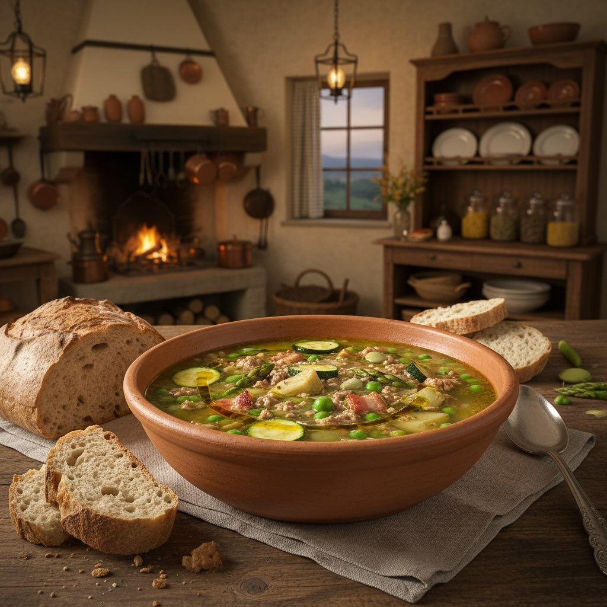

# ### Ingredienti - **400 g di carne macinata** (preferibilmente manzo o vitello) 

### Ingredienti - **400 g di carne macinata** (preferibilmente manzo o vitello) - **100 g di pancetta** a cubetti - **200 g di piselli freschi** - **200 g di fave fresche** - **2 carciofi** - **2 zucchine** - **2 cipollotti** - **1 mazzo di asparagi** - **Brodo vegetale** q.b. - **Olio extravergine d’oliva** q.b. - **Sale e pepe** q.b. - **Pane toscano** (opzionale, per accompagnare) ## Preparazione 1. **Preparazione delle verdure:** - Sgranare i piselli e le fave. - Pulire i carciofi eliminando le foglie esterne più dure e tagliarli a spicchi. - Tagliare le zucchine a cubetti. - Pulire gli asparagi e tagliarli a pezzi. - Affettare finemente i cipollotti. 2. **Rosolare la pancetta:** - In una pentola capiente, scaldare un po&#039;’di olio extravergine d’oliva. - Aggiungere la pancetta e farla rosolare fino a che diventa croccante. 3. **Cuocere la carne:** - Unire la carne macinata alla pancetta e cuocere fino a che non è ben rosolata. - Aggiungere sale e pepe a piacere. 4. **Aggiungere le verdure:** - Unire i cipollotti e cuocere per qualche minuto. - Aggiungere i carciofi, le zucchine, i piselli, le fave e gli asparagi. - Mescolare bene e lasciare insaporire per circa 5 minuti. 5. **Cuocere la zuppa:** - Coprire il tutto con il brodo vegetale caldo. - Lasciar cuocere a fuoco medio-basso per circa 30-40 minuti, finché le verdure non sono tenere. 6. **Servire:** - Aggiustare di sale e pepe se necessario. - Servire la Garmugia calda, accompagnata da fette di pane toscano.

---

*Ricetta da @leguminando*
