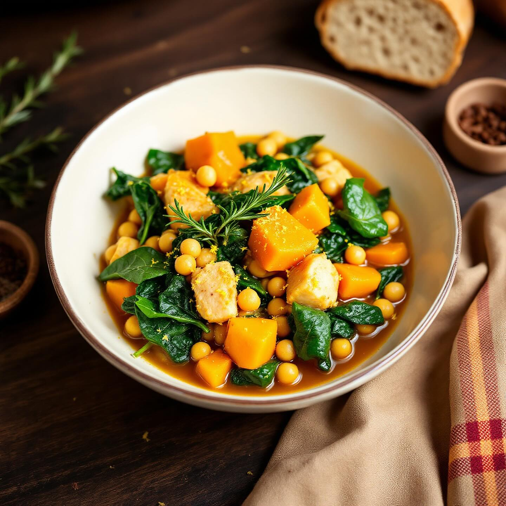

# Ingredienti - 400 g di petto di pollo (tagliato a cubetti) - 240 g di ceci già l

Ingredienti - 400 g di petto di pollo (tagliato a cubetti) - 240 g di ceci già lessati (in scatola o cotti in precedenza) - 200 g di spinaci freschi (meglio se a foglia larga) - 1 piccola zucca o 1 patata dolce (circa 300 g), tagliata a cubetti - 1 cipolla dorata media, tritata - 2 spicchi d’aglio (schiacciati) - 2 rametti di rosmarino - 4 foglie di salvia - 1 bicchiere di brodo di pollo (o vegetale) - 2 cucchiai di olio extravergine d’oliva - Sale e pepe q.b. - Una punta di peperoncino (facoltativa) - Scorza di limone bio grattugiata (per guarnire) Procedimento 1) Rosolare le verdure a. In una casseruola capiente scalda l’olio. b. Aggiungi cipolla e aglio; stufa a fiamma dolce finché la cipolla diventa trasparente (5–7 min). c. Unisci la zucca (o patata dolce), rosmarino e salvia; mescola e fai insaporire per 5 min. 2) Cuocere il pollo a. Alza leggermente la fiamma e aggiungi i cubetti di pollo. b. Rosolali su tutti i lati finché prendono un po’ di colore (4–5 min). c. Sala, pepa e, se ti piace, spolvera con un pizzico di peperoncino. 3) Aggiungere i ceci e il brodo a. Versa i ceci scolati e il brodo caldo. b. Regola di sale se serve. c. Copri con un coperchio e lascia sobbollire a fuoco medio-basso per 15–20 min, finché la zucca è tenera e il brodo si è leggermente ristretto. 4) Mantecare con gli spinaci a. Elimina rosmarino e salvia oppure tienili interi per rimuoverli dopo. b. Aggiungi gli spinaci a foglia larga in più riprese, mescolando finché appassiscono (2–3 min). 5) Impiattare e guarnire a. Versa lo spezzatino nei piatti fondi. b. Spolvera con scorza di limone grattugiata per un tocco fresco. c. Servi subito con crostini integrali o una fetta di pane alle noci. Varianti e consigli • Puoi sostituire i ceci con lenticchie rosse per un tocco più cremoso. • Aggiungi un cucchiaino di curry in polvere insieme alla zucca per un profilo aromatico più deciso. • Se cerchi una versione più “brodosa”, aumenta la quantità di brodo e servi come zuppa. • Il giorno dopo è ancora più saporito: riscaldalo a fuoco dolce aggiungendo un filo d’olio a crudo.

---

*Ricetta da @leguminando*
