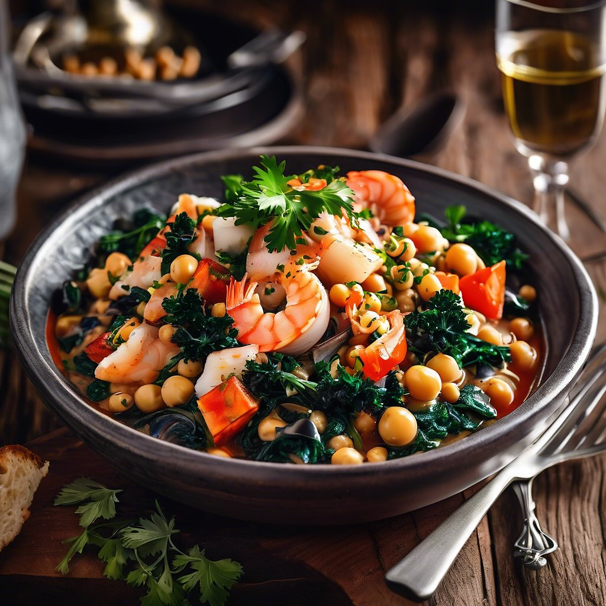

# ### Ingredienti: - 500 g di pesce misto (merluzzo, nasello, seppie, gamberi) - 4

### Ingredienti: - 500 g di pesce misto (merluzzo, nasello, seppie, gamberi) - 400 g di ceci (già lessati) - 2 pomodori maturi - 1 cipolla - 2 spicchi d’aglio - 1 bicchiere di vino rosso - 1 litro di brodo di pesce - 100 g di cavolo nero (pulito e tagliato a striscioline) - Olio extravergine d’oliva - Sale e pepe q.b. - Peperoncino (facoltativo) - Prezzemolo fresco per guarnire - Fette di pane tostato per servire ### Procedimento: 1. **Preparazione delle verdure**: Inizia tritando finemente la cipolla e l’aglio. In una pentola capiente, scalda un filo d’olio extravergine d’oliva e fai soffriggere la cipolla e l’aglio fino a quando non diventano dorati. 2. **Aggiunta del pomodoro**: Unisci i pomodori tagliati a cubetti e cuoci per circa 5 minuti, fino a quando si ammorbidiscono. 3. **Pesce e vino**: Aggiungi il pesce misto tagliato a pezzi e sfuma con il vino rosso. Fai evaporare l’alcol. 4. **Ceci e brodo**: Versa il brodo di pesce e aggiungi i ceci lessati. Porta a ebollizione e poi riduci il fuoco, lasciando cuocere per circa 15-20 minuti. 5. **Cavolo nero**: Negli ultimi 5 minuti di cottura, aggiungi il cavolo nero. Questo si ammorbidirà e arricchirà il piatto. 6. **Condimento**: Regola di sale e pepe, e se desideri, aggiungi un pizzico di peperoncino per un tocco piccante. 7. **Servire**: Servi il cacciucco caldo, guarnito con prezzemolo fresco e accompagnato da fette di pane tostato.

---

*Ricetta da @leguminando*
