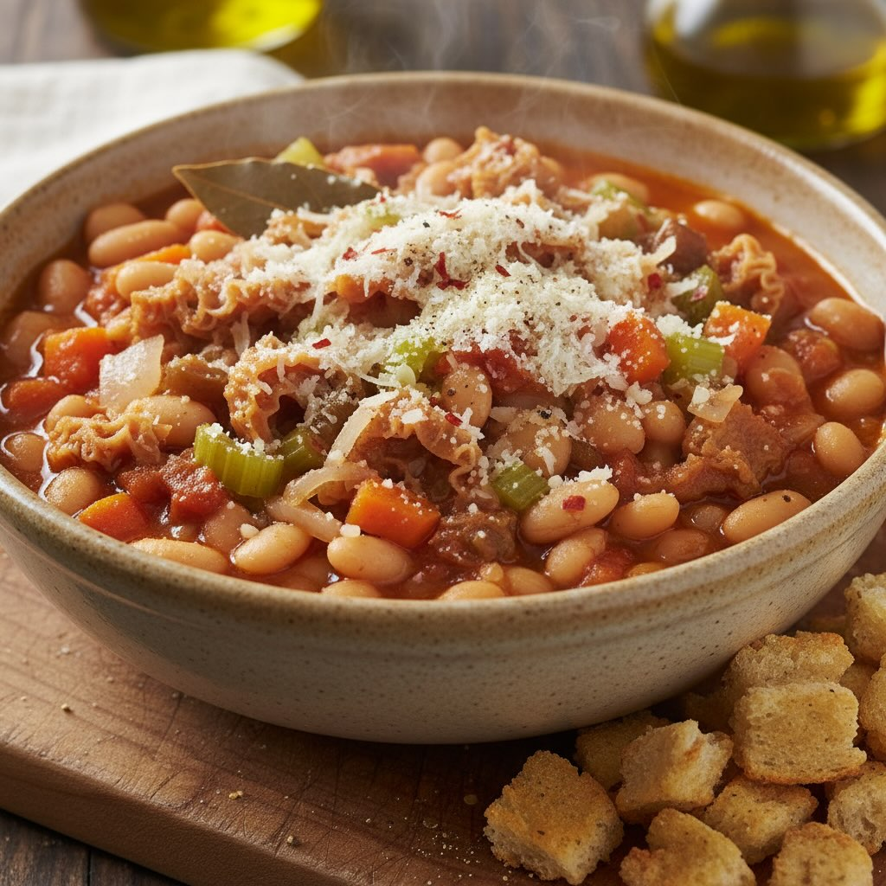

# ### Ingredienti - 500 g di trippa pulita - 150 g di fagioli cannellini secchi (a

### Ingredienti - 500 g di trippa pulita - 150 g di fagioli cannellini secchi (ammollati per almeno 8 ore) - 1 piccola carota - 1/2 cipolla - 1 gambo di sedano - 1 foglia di alloro - 1 cucchiaio colmo di concentrato di pomodoro - Circa 500 ml di brodo vegetale - Olio extravergine di oliva - Sale - Pepe nero - Pecorino q.b. ## Procedimento 1. **Preparazione dei Fagioli** - Dopo aver ammollato i fagioli, scolali e sciacquali bene. - Cuocili in acqua con una foglia di alloro fino a quando saranno teneri. Scolali e mettili da parte. 2. **Cottura della Trippa** - In una pentola capiente, scalda un filo di olio extravergine di oliva. - Aggiungi la cipolla, la carota e il sedano tritati finemente e fai soffriggere fino a quando le verdure sono morbide. 3. **Unione degli Ingredienti** - Aggiungi la trippa tagliata a strisce e mescola bene. - Unisci il concentrato di pomodoro e mescola per insaporire. - Versa il brodo vegetale e porta a ebollizione. 4. **Cottura Lenta** - Aggiungi i fagioli cotti e mescola. - Copri e lascia cuocere a fuoco lento per circa 1-1,5 ore, o fino a quando la trippa è tenera e il sugo si è addensato. - Se necessario, aggiungi altro brodo durante la cottura.

---

*Ricetta da @leguminando*
