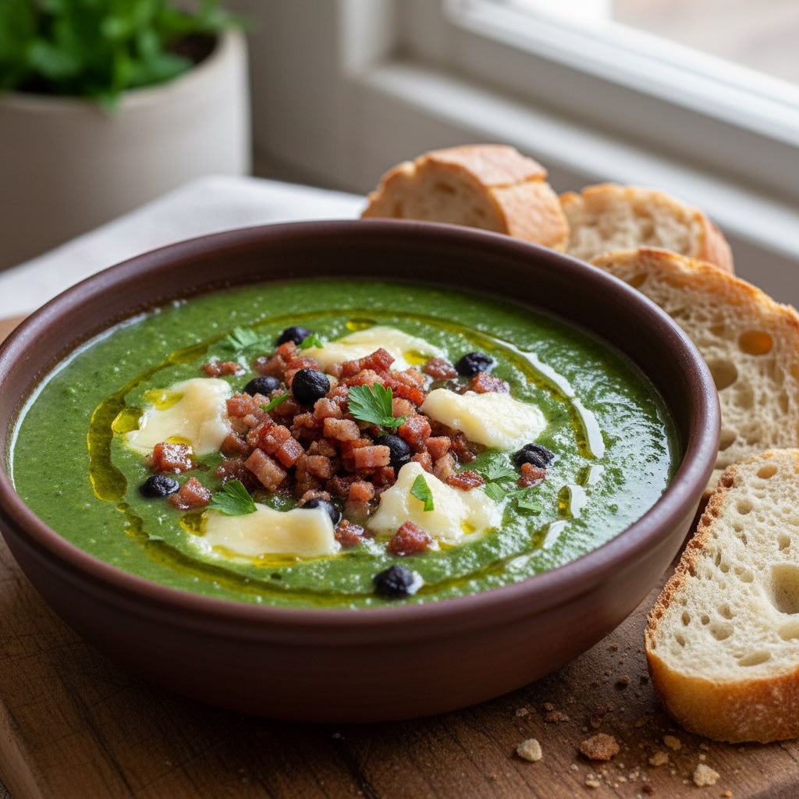

# ### Ingredienti - **500 g** di verza - **150 g** di speck a cubetti - **150 g** 

### Ingredienti - **500 g** di verza - **150 g** di speck a cubetti - **150 g** di fontina - **200 g** di ceci neri cotti - **1** cipolla - **2** spicchi d’aglio - **500 ml** di brodo vegetale - **Olio extravergine d’oliva** q.b. - **Sale** e **pepe** q.b. - **Pane croccante** a piacere ## Procedimento 1. **Preparazione della Verza** - Lava e taglia la verza a striscioline sottili. - In una casseruola, scalda un filo d&#039;’lio e aggiungi la cipolla tritata finemente e l&#039;’glio. Fai soffriggere fino a doratura. 2. **Cottura della Verza** - Aggiungi la verza nella casseruola e mescola bene. Versa il brodo vegetale e lascia cuocere a fuoco medio per circa 20 minuti, finché la verza non sarà morbida. 3. **Frullare la Verza** - Una volta cotta, rimuovi l&#039;’glio e frulla la verza con un frullatore a immersione fino a ottenere una crema liscia. Aggiusta di sale e pepe. 4. **Preparazione del Condimento** - In una padella antiaderente, rosola i cubetti di speck fino a renderli croccanti. - Taglia la fontina a piccoli cubetti. 5. **Assemblaggio del Piatto** - Versa la crema di verza nei piatti fondi. - Distribuisci i ceci neri sulla superficie insieme ai cubetti di speck. - Aggiungi i cubetti di fontina, lasciandoli sciogliere leggermente con il calore della crema. - Completa con un filo d&#039;’lio extravergine d’oliva e, se desideri, servi con pane croccante a parte. Suggerimenti - **Ceci Neri**: Se non hai a disposizione ceci neri, puoi sostituirli con ceci tradizionali. - **Fontina**: Per un sapore più deciso, sperimenta con altri formaggi come il taleggio o il gorgonzola. - **Variazione Vegetariana**: Per una versione vegetariana, ometti lo speck e aggiungi noci tostate o semi di zucca per un tocco croccante.

---

*Ricetta da @leguminando*
