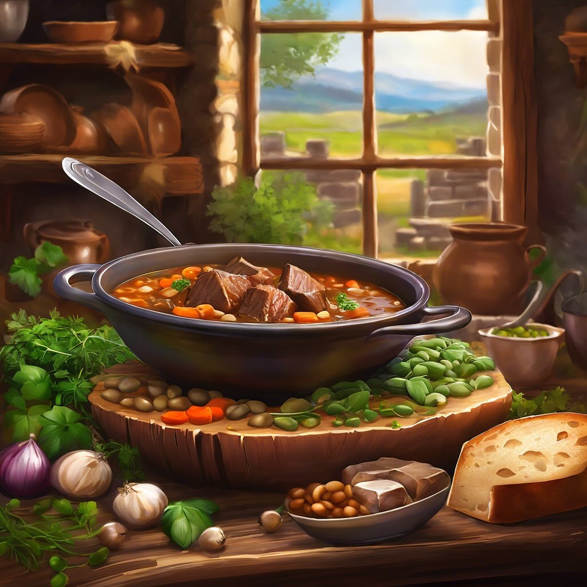

# #### Ingredienti: - 800 g di carne di cinghiale (a pezzi) - 200 g di fagioli (bo

#### Ingredienti: - 800 g di carne di cinghiale (a pezzi) - 200 g di fagioli (borlotti o cannellini, già cotti) - 200 g di lenticchie (già cotte) - 1 cipolla grande (tritata) - 2 carote (a rondelle) - 2 coste di sedano (tritate) - 2 spicchi d’aglio (schiacciati) - 400 ml di vino rosso - 400 g di pomodori pelati (o passata di pomodoro) - 2 rametti di rosmarino - 2 foglie di alloro - 3-4 cucchiai di olio d’oliva - Sale e pepe q.b. #### Istruzioni: 1. **Marinatura del cinghiale** (opzionale ma consigliata): - In una ciotola, mettere la carne di cinghiale, il vino rosso, un rametto di rosmarino, le foglie di alloro, sale e pepe. Lasciare marinare in frigorifero per almeno 4 ore (meglio tutta la notte). 2. **Preparazione del soffritto**: - In una grande casseruola, scaldare l’olio d’oliva a fuoco medio. Aggiungere la cipolla, le carote e il sedano. Soffriggere fino a quando le verdure sono morbide. 3. **Rosolatura della carne**: - Scolare la carne di cinghiale dalla marinata (se utilizzata) e aggiungerla nella casseruola. Rosolare i pezzi di carne su tutti i lati fino a doratura. 4. **Cottura**: - Aggiungere l’aglio, i pomodori pelati (o passata di pomodoro) e mescolare bene. Versare il vino rosso della marinata e portare a ebollizione. Aggiungere le lenticchie e i fagioli già cotti, il rosmarino rimasto, sale e pepe. 5. **Stufare**: - Ridurre il fuoco, coprire la casseruola e lasciare cuocere a fuoco lento per circa 1,5-2 ore, fino a quando la carne è tenera. Se necessario, aggiungere un po’ di acqua o brodo durante la cottura per evitare che si asciughi. 6. **Servizio**: - Una volta cotto, assaporare e regolare di sale e pepe. Servire caldo, magari accompagnato da una polenta o del pane croccante.

---

*Ricetta da @leguminando*
