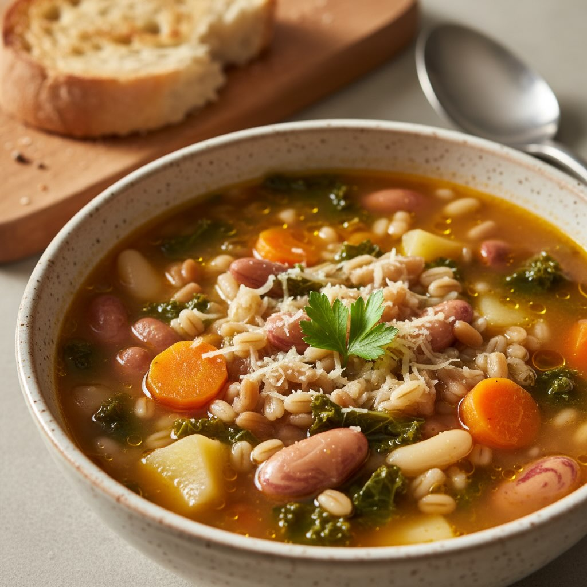

# Ingredienti - 80 g orzo perlato - 80 g farro perlato - 100 g fagioli borlotti se

Ingredienti - 80 g orzo perlato - 80 g farro perlato - 100 g fagioli borlotti secchi (oppure 240 g borlotti in scatola, scolati) - 100 g fagioli cannellini secchi (oppure 240 g cannellini in scatola, scolati) - 2 carote medie - 2 patate medie (circa 300 g) - 200 g cavolo nero - 1 cipolla piccola - 1 costa di sedano - 1 spicchio d’aglio - 1,5 l di brodo vegetale (o acqua calda + dado) - 3 cucchiai di olio extravergine d’oliva - 1 rametto di rosmarino (o una foglia d’alloro) - Sale e pepe q.b. - Peperoncino (facoltativo) - Parmigiano o pecorino grattugiato per servire (facoltativo) Preparazione 1. Ammollo dei legumi (se usi quelli secchi) • Metti borlotti e cannellini in due ciotole separate: copri con acqua fredda e lascia in ammollo almeno 8–12 ore. • Trascorso il tempo, scola e risciacqua bene. 2. Soffritto di base • In una pentola capiente scalda l’olio, aggiungi cipolla, sedano e carota tritati finemente. • Unisci lo spicchio d’aglio schiacciato e il rametto di rosmarino; fai appassire a fuoco medio-basso per 5–6 minuti, senza far brunire. 3. Cottura legumi e cereali • Se usi legumi secchi, aggiungili al soffritto, mescola 2 minuti e copri con il brodo caldo. Porta a ebollizione, poi abbassa la fiamma, copri e lascia sobbollire per 30 minuti. • Trascorsi 30 min, unisci orzo perlato e farro, mescola e prosegui la cottura 20 minuti a tegame coperto, aggiungendo brodo se necessario. 4. Verdure radice e cavolo nero • Pela e taglia le patate a cubetti di 1–1,5 cm; affetta le carote a rondelle. Dopo i primi 20 min di cottura di cereali e legumi (o subito dopo i legumi in scatola), unisci patate e carote. • Nel frattempo lava il cavolo nero, elimina la costa centrale più dura e taglia le foglie a strisce. Dopo altri 10 min di cottura, aggiungilo in pentola. 5. Ultimi minuti e mantecatura • Dopo circa 5–7 minuti dal cavolo, controlla la consistenza: i cereali devono essere teneri ma non scotti, le patate leggermente cremose. • Aggiusta di sale e pepe; se ti piace, un pizzico di peperoncino. Spegni il fuoco e lascia riposare coperto 5 minuti.

---

*Ricetta da @leguminando*
