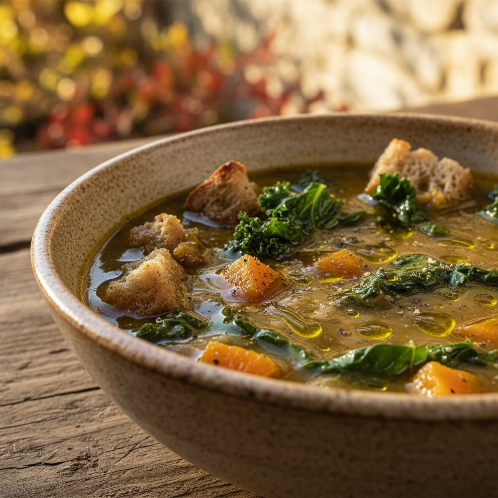

# Ingredienti - Fagioli borlotti secchi: 250 g - Fagioli cannellini secchi: 150 g 

Ingredienti - Fagioli borlotti secchi: 250 g - Fagioli cannellini secchi: 150 g - Cipolla bianca: 1 - Porro: 1 - Spicchio d’aglio: 1 - Carota: 1 - Sedano: 1 costa - Finocchio: 1/2 - Cavolfiore: 1/4 (circa 200 g) - Cavolo nero: 1 mazzetto - Bietole: 1 mazzetto - Zucchina: 1 - Patata: 1 - Zucca: 1 fetta (circa 200 g) - Piselli (anche surgelati): 100 g - Pomodoro ramato: 1 - Erbe aromatiche: qualche foglia di salvia, qualche rametto di timo - Noce moscata: 1 pizzico - Osso di prosciutto: 1 pezzo - Pane toscano raffermo: 8 fette - Olio extravergine d’oliva: q.b. - Sale e pepe: q.b. Preparazione 1. Preparazione dei legumi - Sciacquate e mettete a bagno i fagioli borlotti e cannellini in abbondante acqua fredda per almeno 8 ore o tutta la notte. 2. Preparazione del brodo e delle verdure - Tritate finemente cipolla, porro, aglio, carota e sedano. - Tagliate a pezzi il finocchio, la zucchina, la patata, e la zucca. - Lavate e tagliate a striscioline il cavolo nero e le bietole. - Riducete il cavolfiore in cimette e tagliate a dadini il pomodoro. 3. Cottura della zuppa - In una pentola capiente, rosolate in olio d’oliva il trito di cipolla, porro, aglio, carota e sedano. - Aggiungete i fagioli scolati e coprite con abbondante acqua fredda. Unite l’osso di prosciutto e portate a ebollizione. - Aggiungete tutte le verdure preparate e i piselli, mescolando bene. - Unite le erbe aromatiche e un pizzico di noce moscata. - Cuocete a fuoco lento per circa 1 ora e mezza, aggiungendo acqua se necessario, finché i fagioli e le verdure saranno teneri. - Aggiustate di sale e pepe. 4. Preparazione del pane - Affettate il pane raffermo e tostatelo leggermente in forno o su una griglia. 5. Assemblaggio e servizio - Disponete le fette di pane tostato sul fondo di ogni piatto. - Versatevi sopra la zuppa calda, lasciando che il pane si impregni bene. - Completate con un generoso filo di olio extravergine d’oliva appena spremuto e, se gradite, una macinata di pepe fresco.

---

*Ricetta da @leguminando*
