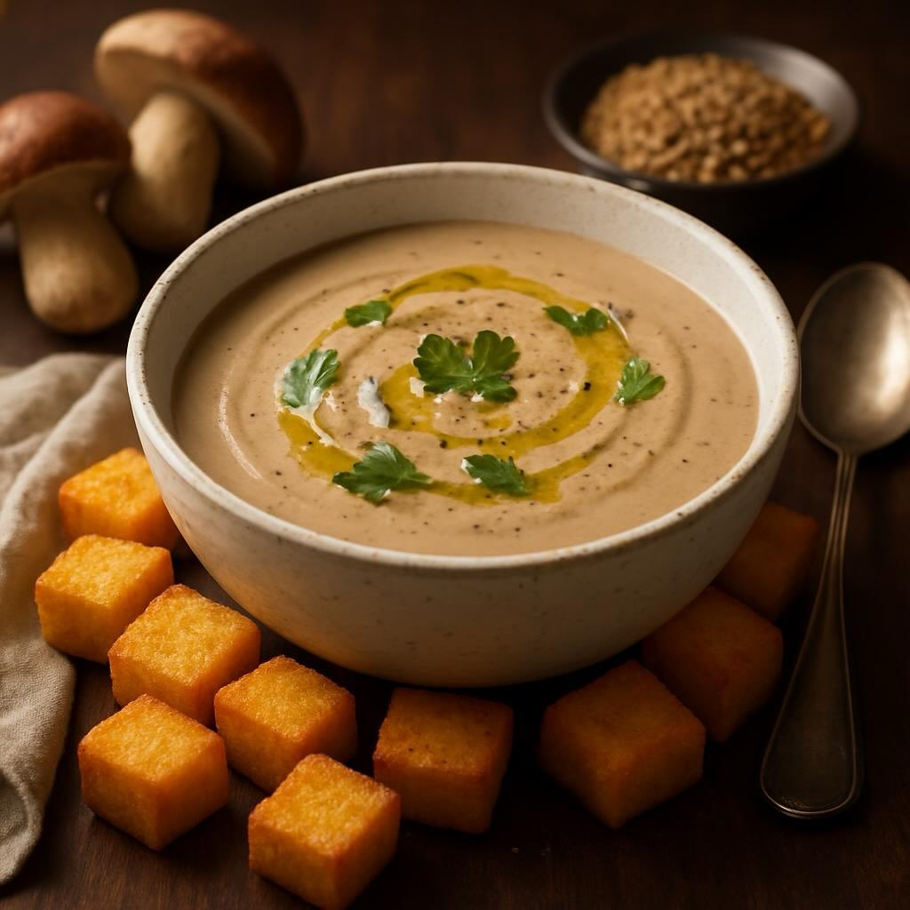

# ### Ingredienti - **Funghi porcini freschi**: 300 g (o 100 g secchi) - **Lenticc

### Ingredienti - **Funghi porcini freschi**: 300 g (o 100 g secchi) - **Lenticchie**: 200 g (preferibilmente lenticchie verdi o marroni) - **Cipolla**: 1 media - **Aglio**: 2 spicchi - **Brodo vegetale**: 1 litro - **Olio extravergine d’oliva**: 3 cucchiai - **Sale**: q.b. - **Pepe nero**: q.b. - **Prezzemolo fresco**: per guarnire - **Panna vegetale** (opzionale): 100 ml ## Preparazione 1. **Preparare le lenticchie**: - Sciacquare le lenticchie sotto acqua corrente. - In una pentola, portare a ebollizione il brodo vegetale e aggiungere le lenticchie. Cuocere per circa 20-30 minuti, fino a quando sono tenere. Scolare e mettere da parte. 2. **Soffriggere le verdure**: - In una casseruola, scaldare l&#039;’lio d&#039;’liva a fuoco medio. - Aggiungere la cipolla tritata e l&#039;’glio schiacciato. Soffriggere fino a quando la cipolla diventa trasparente. 3. **Cuocere i funghi**: - Pulire i funghi porcini e tagliarli a fette. Aggiungerli nella casseruola con la cipolla e l&#039;’glio. Cuocere per circa 5-7 minuti, fino a quando i funghi sono morbidi e leggermente dorati. - Se si utilizzano funghi porcini secchi, metterli in ammollo in acqua calda per circa 20 minuti, quindi tritarli e aggiungerli al soffritto. 4. **Unire lenticchie e brodo**: - Aggiungere le lenticchie cotte ai funghi nella casseruola. Mescolare bene e aggiungere un po’ di brodo vegetale per ottenere la consistenza desiderata. - Cuocere a fuoco lento per circa 10 minuti. 5. **Frullare la crema**: - Utilizzare un frullatore a immersione per frullare la crema fino a ottenere una consistenza liscia. Se si desidera, aggiungere la panna vegetale per rendere la crema ancora più cremosa. - Aggiustare di sale e pepe a piacere. 6. **Servire**: - Versare la crema di funghi porcini e lenticchie in ciotole e guarnire con prezzemolo fresco tritato. - Servire calda, accompagnata con crostini di pane o fette di pane tostato.

---

*Ricetta da @leguminando*
