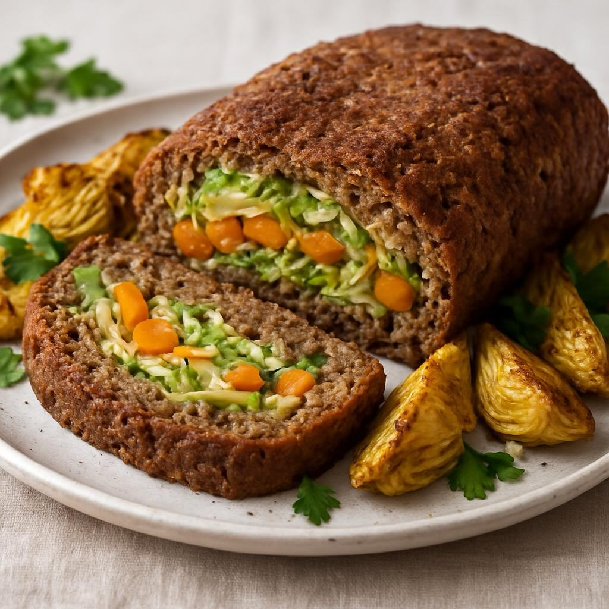

# Ingredienti - Per il polpettone: - 300 g lenticchie cotte (peso scolato) - 100 g

Ingredienti - Per il polpettone: - 300 g lenticchie cotte (peso scolato) - 100 g pangrattato (+ q.b. per regolare la consistenza) - 1 uovo (o 1 cucchiaio di farina di ceci per versione veg) - 1 spicchio d’aglio tritato (opz.) - 1 cucchiaino di cumino o paprika affumicata (opz.) - 2 cucchiai di olio extravergine d’oliva - Sale e pepe q.b. - Prezzemolo tritato q.b. - Per il ripieno: - 200 g cavolo (verza o cavolo cappuccio) tagliato a julienne finissima - 1 porro (solo parte bianca) affettato sottile - 200 g zucca pulita a cubetti piccoli - 1 cucchiaio d’olio + sale e pepe - Noce moscata q.b. (opzionale) - Per i carciofi: - 4 carciofi (o 6 piccoli), puliti e tagliati a spicchi - 2 cucchiai olio d’oliva - Succo di limone q.b. - 1 cucchiaino curcuma in polvere - Sale e pepe

---

*Ricetta da @leguminando*
