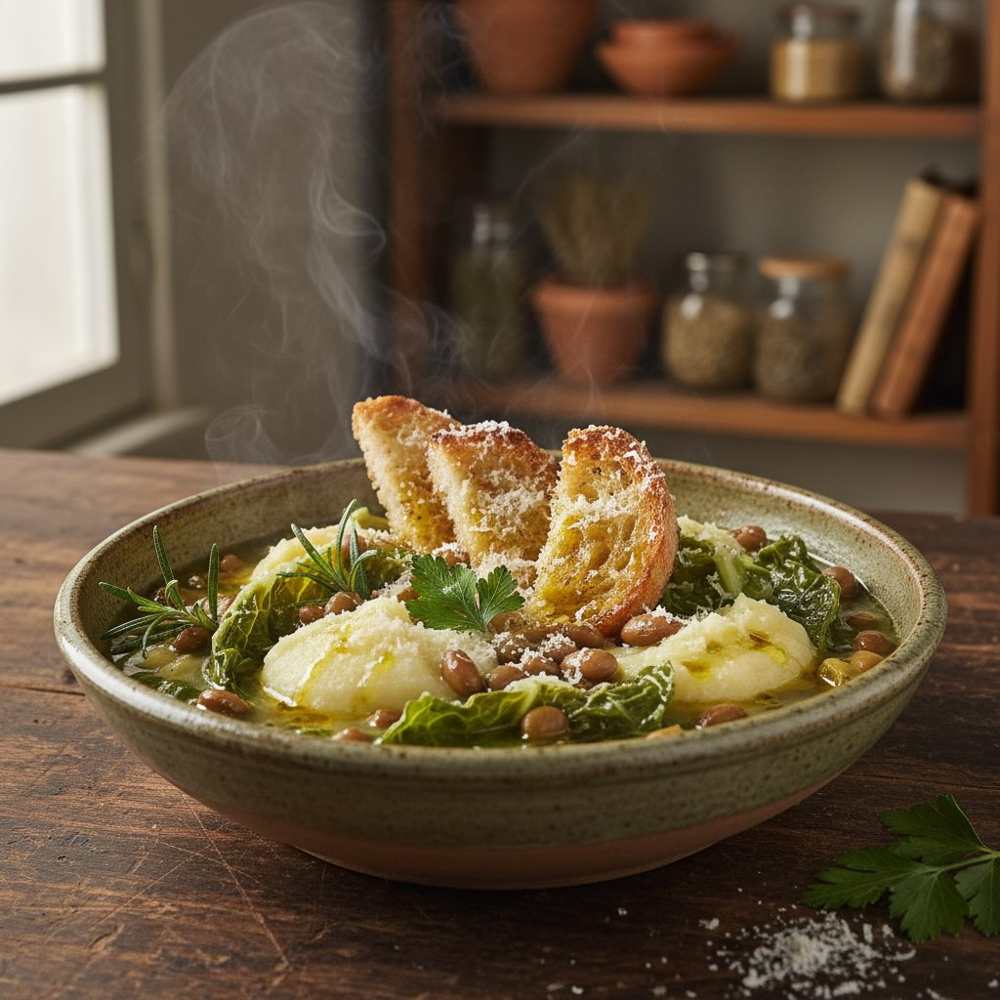

# **Ingredienti Dettagliati:** - **300 g di Roveja**: Lasciare in ammollo per alme

**Ingredienti Dettagliati:** - **300 g di Roveja**: Lasciare in ammollo per almeno 8 ore, poi cuocere per 45-60 minuti finché non è tenera. - **1 kg di Verze**: Cuocere intere, senza tagliare le foglie. - **4-5 patate medie**: Preferibilmente a pasta gialla, da sbucciare e ridurre in cubetti. - **2 litri di Brodo**: Può essere vegetale o di pollo, a seconda delle preferenze. - **1 cipolla grande**, **1 carota media**, **1 gambo di sedano**: Tritati finemente per il soffritto. - **2 cucchiai di olio extravergine d’oliva** e **30 g di burro**: Per rendere la crema più vellutata. - **Rosmarino fresco, sale, pepe nero macinato, noce moscata**: Per insaporire il piatto. - **Crostini di pane tostato e parmigiano stagionato**: Per guarnire il piatto finale. 1. **Preparazione della Roveja**: Sciacquare i legumi sotto acqua corrente, poi lasciarli in ammollo per almeno 8 ore, preferibilmente durante la notte. Dopo l’ammollo, scolarli e trasferirli in una pentola grande, coprire con acqua fresca e portare a ebollizione. Ridurre il fuoco e cuocere per 45-60 minuti, finché i legumi non risultano teneri ma ancora interi. Scolare e conservare qualche mestolo di liquido di cottura. 2. **Crema di Patate**: Sbucciare le patate e tagliarle a cubetti di circa 2 cm. Far bollire il brodo e cuocere i cubetti di patata per 10-12 minuti, finché non diventano morbidi. Scolare e frullare le patate con un mixer ad immersione, aggiungendo gradualmente il brodo fino a ottenere una consistenza liscia e cremosa. Rimettere la crema sul fuoco basso, aggiungere la panna e il burro, e regolare con sale, pepe e noce moscata. 3. **Preparazione della Zuppa**: In una casseruola ampia, scaldare l’olio a fuoco medio e soffriggere la cipolla, la carota e il sedano per circa 5-6 minuti, finché risultano morbidi. Aggiungere il rametto di rosmarino per aromatizzare, quindi incorporare la roveja cotta e, se necessario, un po’ del liquido di cottura. Versare il brodo e portare a ebollizione, ridurre il fuoco e lasciare sobbollire per 20 minuti.

---

*Ricetta da @leguminando*
