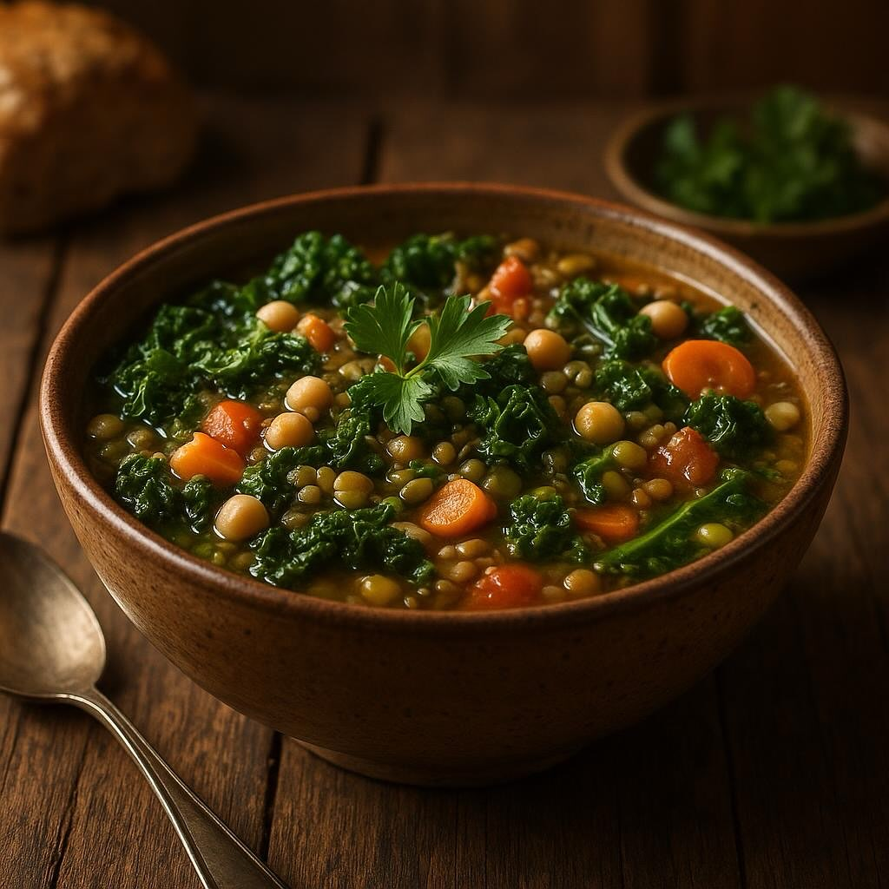

# Ingredienti • 200 g lenticchie (secche) • 200 g fagioli borlotti o cannellini (s

Ingredienti • 200 g lenticchie (secche) • 200 g fagioli borlotti o cannellini (secchi o precotti) • 100 g orzo perlato • 100 g farro perlato • 1 carota media • 1 gambo di sedano • 1 cipolla media • 2 spicchi d’aglio • 2 cucchiai di olio extravergine d’oliva • 1,5–2 l di brodo vegetale (meglio fatto in casa o leggero) • 1 rametto di rosmarino • Qualche rametto di timo fresco • Sale grosso q.b. • Pepe nero macinato al momento Preparazione 1. Ammollo e cottura preliminare a. Se usi legumi secchi, metti lenticchie e fagioli in acqua fredda a bagno per almeno 8 ore (i fagioli richiedono più tempo). b. Scola, sciacqua e lessa i fagioli in acqua leggermente salata per 40 min–1 h, finché sono teneri. Scola e metti da parte. 2. Il battuto di base a. Trita finemente carota, sedano, cipolla e aglio. b. Scalda l’olio in una pentola capiente a fuoco medio. c. Aggiungi il battuto e lascia appassire dolcemente per 10–12 min, mescolando spesso, evitando che prenda colore (deve solo “sudare”). 3. Prima riduzione a. Unisci un mestolo di brodo caldo al battuto e lascia sobbollire fino a quasi completo assorbimento. b. Ripeti l’operazione 2–3 volte: aggiungi brodo, fai asciugare, in modo da concentrare i sapori. 4. Aggiunta di legumi e cereali a. Versa in pentola lenticchie e fagioli lessati. Mescola. b. Aggiungi orzo e farro, distribuiscili uniformemente. 5. Lunga cottura a fuoco lento a. Copri con il brodo restante (deve superare di circa 2 cm il livello degli ingredienti). b. Aggiungi rosmarino e timo. Porta a leggero bollore, poi abbassa la fiamma al minimo. c. Cuoci per 1–1½ ora senza coperchio, mescolando di tanto in tanto e aggiungendo brodo se si asciuga troppo. 6. Regolazione finale a. Elimina il rametto di rosmarino. b. Aggiusta di sale e pepe. Se la zuppa ti pare troppo densa, stempera con un mestolo di brodo caldo. 7. Servizio • Versa la zuppa nei piatti, condisci con un filo d’olio a crudo e una spolverata di pepe. • Se ti piace, aggiungi una fogliolina di timo fresco o una manciata di prezzemolo tritato.

---

*Ricetta da @leguminando*
