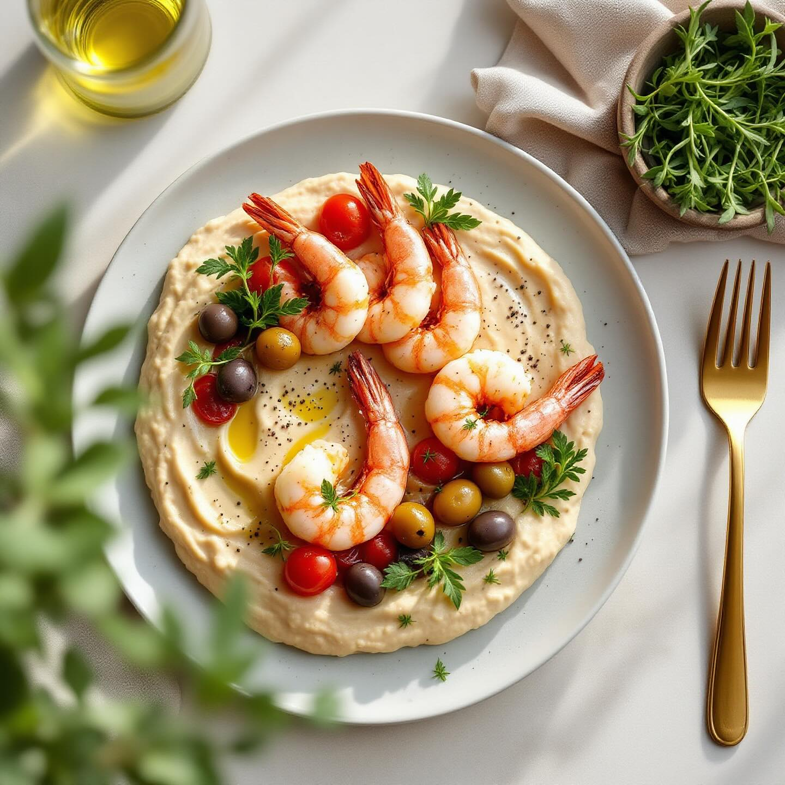

# Ingredienti • 2 porri medi (solo la parte bianca) • 300 g di pomodori ciliegino 

Ingredienti • 2 porri medi (solo la parte bianca) • 300 g di pomodori ciliegino • 250 g di ceci lessati (in lattina o già cotti) • 16 code di gambero (fresche o decongelate) • 12 olive taggiasche • 2 rametti di timo fresco • Olio extravergine d’oliva q.b. • Sale e pepe nero q.b. • Acqua o brodo vegetale q.b. • Facoltativo: un pizzico di peperoncino in polvere Preparazione 1. Crema di porri e pomodorini a. Affetta finemente i porri. Taglia a metà i ciliegini. b. In un tegame, scalda 2 cucchiai d’olio, unisci i porri e fai appassire a fuoco dolce per 5’. c. Aggiungi i pomodorini, regola di sale, copri e lascia cuocere 8–10’ aggiungendo un goccio d’acqua o brodo se si asciugano troppo. d. Frulla il tutto fino a ottenere una crema liscia. Tieni in caldo. 2. Hummus di ceci, olive e timo a. Scola e sciacqua i ceci. Nel mixer, metti i ceci, 4 olive denocciolate, un filo d’olio, le foglioline di un rametto di timo, sale e pepe. b. Frulla aggiungendo un po’ d’acqua o olio fino alla consistenza vellutata di un hummus. c. Trasferisci in una ciotolina, decora con qualche fogliolina di timo e un’oliva tagliata a rondelle. 3. Gamberi al timo a. Pulisci le code di gambero, elimina il filo intestinale. b. In una padella antiaderente, scalda un filo d’olio con l’altro rametto di timo e, se ti piace, un pizzico di peperoncino. c. Sala leggermente i gamberi e saltali 1’ per lato a fiamma vivace, fino a quando diventano rosa e leggermente croccanti. Spegni subito per non seccarli. 4. Impiattamento a. Su 4 piatti fondi o 4 ciotoline, stendi prima la crema di porri e pomodorini. b. Accanto o al centro, forma un piccolo ciuffo di hummus ai ceci. c. Sopra la crema, adagia 4 code di gambero per piatto. d. Completa con le olive rimaste tagliate a pezzetti, un filo d’olio a crudo e una spolverata di pepe nero. Varianti e consigli • Puoi sostituire le olive taggiasche con olive verdi in salamoia per un tocco più deciso. • Se ti piace il profumo affumicato, aggiungi una punta di paprika dolce alla crema di pomodoro. • Servi con crostini di pane tostato per raccogliere le creme.

---

*Ricetta da @leguminando*
