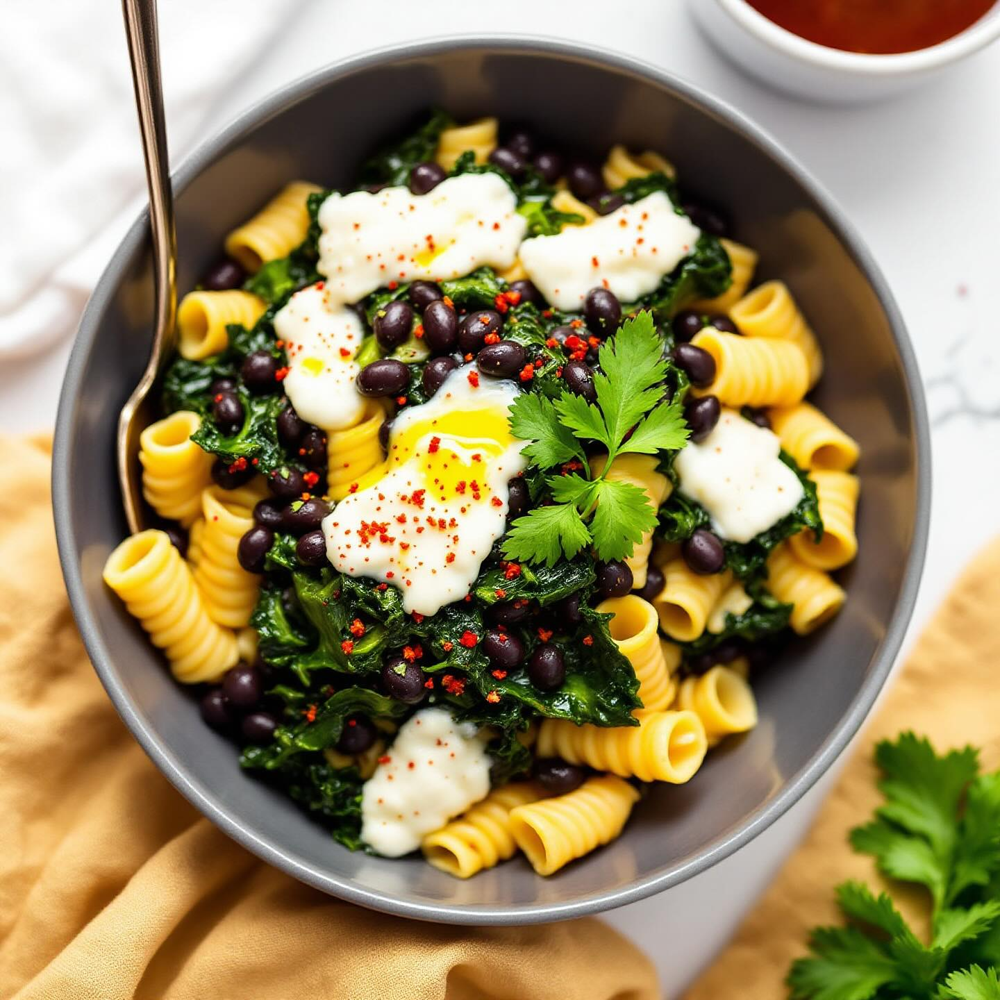

# Ingredienti • 320 g di pasta corta (ditalini, mezze maniche o tubetti) • 250 g d

Ingredienti • 320 g di pasta corta (ditalini, mezze maniche o tubetti) • 250 g di fagioli neri lessati (in scatola – scolati e sciacquati, oppure secchi – ammollati e lessati) • 200 g di cavolo nero pulito e tagliato a striscioline • 120 g di provola piccante a dadini • 1 cipolla piccola, tritata fine • 2 spicchi d’aglio, schiacciati • 1 peperoncino rosso fresco (facoltativo), tritato • 3 cucchiai d’olio extravergine d’oliva • 400 ml di brodo vegetale caldo • Sale, pepe nero e un pizzico di peperoncino in polvere (se vuoi più piccantezza) • Una manciata di prezzemolo fresco tritato Procedimento 1) Soffritto In una casseruola capiente scalda l’olio. Unisci cipolla, aglio e peperoncino fresco. Fai appassire a fuoco medio-basso finché la cipolla è trasparente (5–7 minuti). 2) Cavolo nero Aggiungi il cavolo nero e mescola; lascialo cuocere 3–4 minuti finché si ammorbidisce leggermente. 3) Fagioli e brodo Versa i fagioli neri e prosegui la cottura per 2 minuti, poi bagna con il brodo caldo. Aggiusta di sale e pepe. Copri e fai sobbollire dolcemente per 10 minuti. 4) Cuocere la pasta Nel frattempo porta a ebollizione abbondante acqua salata, cuoci la pasta per 2 minuti in meno rispetto al tempo indicato sulla confezione. Scolala e trasferiscila direttamente nella casseruola con il sughetto di fagioli e cavolo (un po’ di acqua di cottura aiuterà la cremosità). 5) Mantecatura con provola Abbassa la fiamma, aggiungi i dadini di provola piccante e mescola delicatamente fino a farli appena sciogliere: si formeranno filamenti e un velo cremoso. Se serve, allunga con un cucchiaio d’acqua di cottura. 6) Impiattare Completa con una spolverata di prezzemolo, un filo d’olio a crudo e, se gradisci, una macinata extra di pepe o un pizzico di peperoncino in polvere.

---

*Ricetta da @leguminando*
