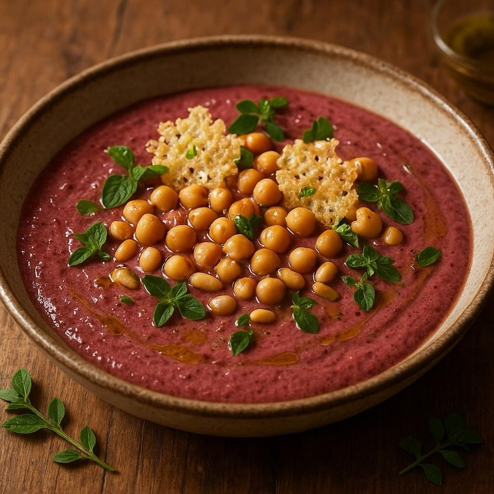

# Ingredienti • 320 g di pasta corta (penne rigate, mezze maniche o fusilli) • 2 c

Ingredienti • 320 g di pasta corta (penne rigate, mezze maniche o fusilli) • 2 cespi di radicchio rosso (≈ 400 g) • 200 g di ceci già lessati (in scatola o cotti in casa) • 1 cipolla piccola • 1 spicchio d’aglio • 50 ml di vino bianco secco • 300 ml di brodo vegetale (o acqua) • 3 cucchiai d’olio extravergine d’oliva • 30 g di pinoli • 60 g di Parmigiano Reggiano in un’unica forma piccola • Sale e pepe q.b. Procedimento 1. Preparare le scaglie di Parmigiano • Scaldate il forno a 180 °C (statico). • Con l’aiuto di un pelapatate ricavate dal formaggio strisce di Parmigiano spesse circa 1–2 mm. Disponetele su una teglia ricoperta di carta forno. • Infornate per 5–7 minuti, finché diventano dorate e croccanti. Sfornate e fate raffreddare. 2. Tostare i pinoli • In un padellino antiaderente senza condimento, scaldate i pinoli per 2–3 minuti a fuoco medio, mescolando spesso, finché assumono un colorito leggermente dorato. Teneteli da parte. 3. Preparare la crema di radicchio • Mondate il radicchio, eliminate la costa più dura e tagliatelo a striscioline. • In una padella capiente scaldate 2 cucchiai d’olio con lo spicchio d’aglio schiacciato e la cipolla tritata finemente. Fate appassire a fuoco basso per 4–5 minuti, evitando che la cipolla si colori troppo. • Unite il radicchio, alzate leggermente la fiamma e sfumate con il vino bianco. Quando è evaporato, aggiungete il brodo, coprite e cuocete 8–10 minuti, finché il radicchio è morbido. • Eliminate l’aglio, trasferite tutto nel bicchiere del frullatore (o usate un frullatore a immersione), aggiustate di sale e pepe e riducete a crema liscia. 4. Cuocere la pasta e unire i ceci • Portate a ebollizione abbondante acqua salata. Cuocete la pasta al dente, seguendo i minuti indicati sulla confezione. • Scolatela tenendo da parte un mestolo di acqua di cottura.

---

*Ricetta da @leguminando*
