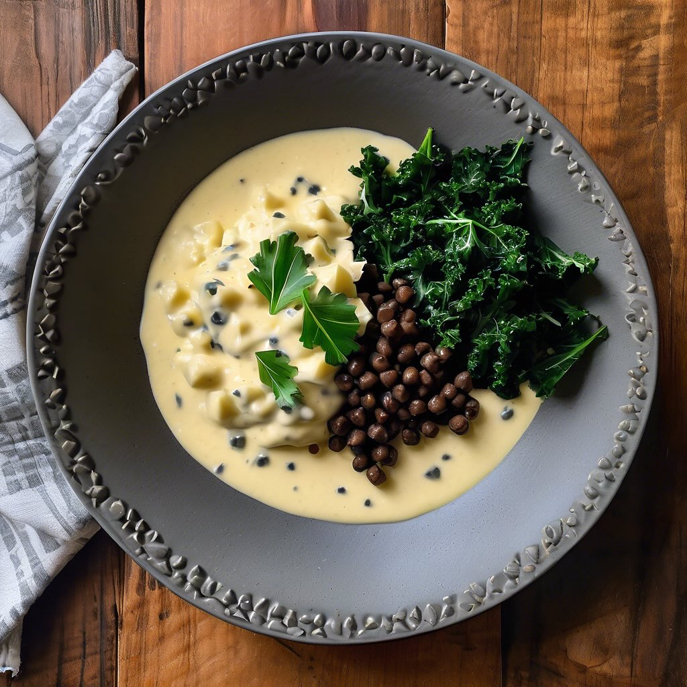

# Ingredienti: • 4 carciofi • 200 g di ceci neri (già cotti o in scatola) • 3 spic

Ingredienti: • 4 carciofi • 200 g di ceci neri (già cotti o in scatola) • 3 spicchi d’aglio • 200 g di foglie di cavolo nero • 1 cipolla • 500 ml di brodo vegetale • Olio extravergine d’oliva • Sale e pepe q.b. • Succo di limone (facoltativo) • Pecorino grattugiato (facoltativo, per servire) Procedimento: 1. Preparazione dei carciofi: • Pulisci i carciofi eliminando le foglie esterne più dure e la parte superiore. Tagliali a metà e rimuovi la barba interna. Taglia a fettine sottili. 2. Cottura del cavolo nero: • In una pentola con acqua bollente e salata, sbollenta le foglie di cavolo nero per circa 5-7 minuti, finché non diventano tenere. Scolale e mettile da parte. 3. Soffritto: • In una pentola capiente, scalda un filo d’olio extravergine d’oliva e aggiungi la cipolla tritata e gli spicchi d’aglio a pezzi. Fai rosolare fino a quando la cipolla diventa traslucida. 4. Cottura dei carciofi: • Aggiungi i carciofi nella pentola e cuoci per circa 5 minuti, mescolando di tanto in tanto. I carciofi dovrebbero iniziare a diventare teneri. 5. Aggiunta dei ceci: • Unisci i ceci neri, mescola bene e versa il brodo vegetale. Porta a ebollizione e lascia cuocere per circa 15-20 minuti. 6. Frullatura: • Una volta che i carciofi sono teneri, usa un frullatore a immersione per frullare il composto fino a ottenere una consistenza cremosa. Se necessario, aggiungi un po’ di brodo per regolare la densità. 7. Incorporazione del cavolo: • Aggiungi le foglie di cavolo nero lesse al passato e mescola bene. Lascia cuocere per ulteriori 5 minuti. 8. Aggiustamento di sapore: • Regola di sale e pepe. Se gradito, aggiungi un po’ di succo di limone per dare freschezza. 9. Servizio: • Servi il passato caldo, guarnito con un filo d’olio extravergine d’oliva e, se vuoi, una spolverata di pecorino grattugiato.

---

*Ricetta da @leguminando*
