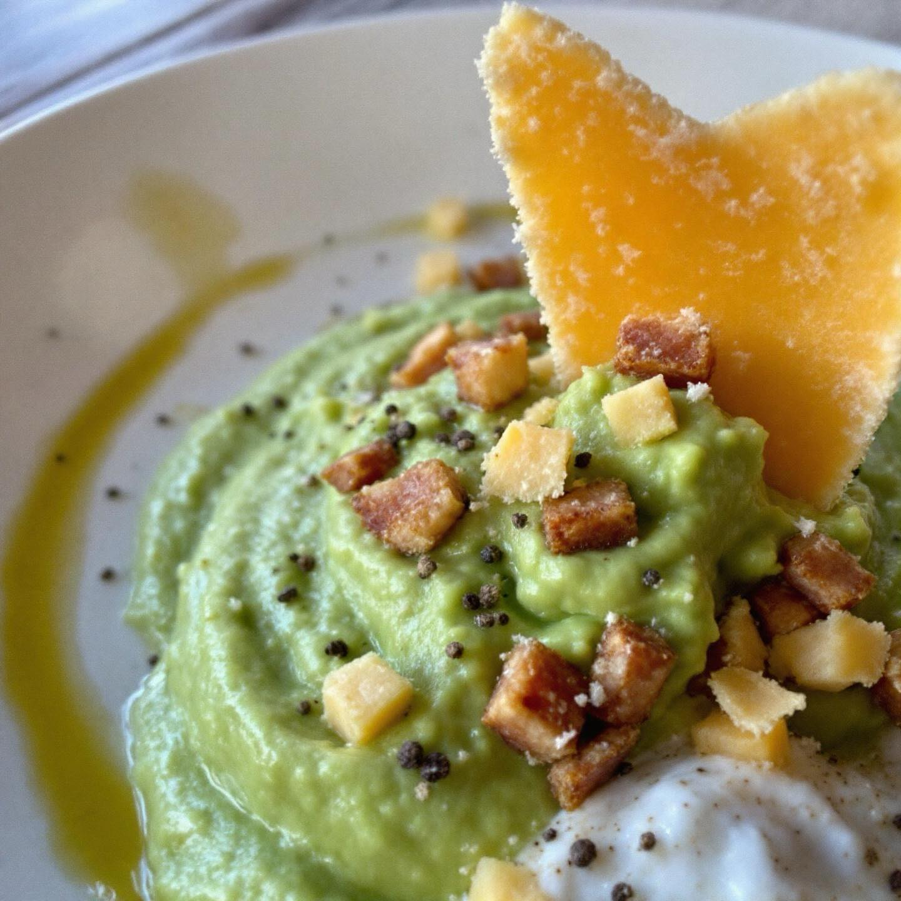

# Ingredienti • 500 g piselli • 1 scalogno • 30 g burro • 100 ml panna • 200 ml br

Ingredienti • 500 g piselli • 1 scalogno • 30 g burro • 100 ml panna • 200 ml brodo vegetale • 100 g speck a cubetti • 6 cucchiai Parmigiano grattugiato • Olio extravergine, sale, pepe Preparazione 1. Sfoglie di Parmigiano: su carta forno distribuisci 2 cucchiai di formaggio a “cerchi”, cuoci 5–7 min a 200 °C finché dorano, stacca e raffredda. 2. Crema di piselli: fai appassire lo scalogno nel burro, unisci i piselli, copri col brodo e cuoci 10 min. Frulla con panna, regola sale e pepe e filtra. 3. Speck: rosola i cubetti in padella calda finché croccanti, scola su carta cucina. 4. Impiatta: dividi la crema in 4 fondine, aggiungi lo speck al centro, infila la sfoglia di Parmigiano e termina con un filo d’olio e pepe. Buon appetito!

---

*Ricetta da @leguminando*
