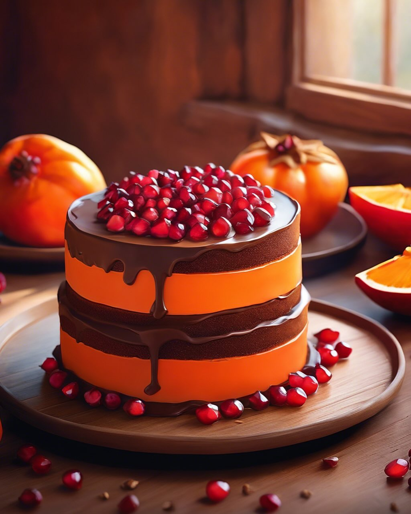

# ### Ingredienti #### Per il merluzzo: - 4 filetti di merluzzo - 100 g di farina 

### Ingredienti #### Per il merluzzo: - 4 filetti di merluzzo - 100 g di farina di lenticchie rosse &#064;alcenerobiologico - 100 g di farina di lenticchie nere - 1 uovo - 50 g di pangrattato - Sale e pepe q.b. - Olio extravergine d’oliva &#064;slowfood_costaetruschiaps &#064;slowfoodlivorno #### Per la crema di cavolo cappuccio: - 300 g di cavolo cappuccio (bianco o rosso) - 1 patata media - 1 cipolla - 500 ml di brodo vegetale - Sale e pepe q.b. - Olio extravergine d’oliva ### Istruzioni #### Preparazione della crema di cavolo cappuccio: 1. **Preparare gli ingredienti**: Tagliare finemente la cipolla e il cavolo cappuccio. Sbucciare e tagliare a cubetti la patata. 2. **Cottura**: In una pentola, scaldare un filo d’olio extravergine d’oliva e aggiungere la cipolla. Soffriggere fino a farla diventare trasparente. 3. **Aggiungere cavolo e patata**: Unire il cavolo cappuccio e la patata, mescolare e cuocere per alcuni minuti. 4. **Aggiungere il brodo**: Versare il brodo vegetale e portare a ebollizione. Cuocere per circa 20 minuti o fino a quando le verdure sono tenere. 5. **Frullare**: Utilizzare un frullatore a immersione per ottenere una crema liscia. Aggiustare di sale e pepe. #### Preparazione del merluzzo in crosta: 1. **Preparare la panatura**: In una ciotola, mescolare la farina di lenticchie rosse e nere con il pangrattato. Aggiungere sale e pepe a piacere. 2. **Passare il merluzzo**: In un’altra ciotola, sbattere l’uovo. Immergere i filetti di merluzzo nell’uovo, quindi passarli nella miscela di farine e pangrattato, pressando bene per far aderire la crosta. 3. **Cottura**: In una padella, scaldare un filo d’olio extravergine d’oliva. Cuocere i filetti di merluzzo a fuoco medio per circa 3-4 minuti per lato, fino a quando sono dorati e croccanti. ### Presentazione del piatto: 1. **Impiattare**: Distribuire la crema di cavolo cappuccio sul fondo del piatto. Adagiare sopra i filetti di merluzzo in crosta. 2. **Guarnire**: Decorare con un filo d’olio extravergine d’oliva e, se desiderato, con qualche foglia di cavolo cappuccio crudo o erbe fresche.

---

*Ricetta da @leguminando*
