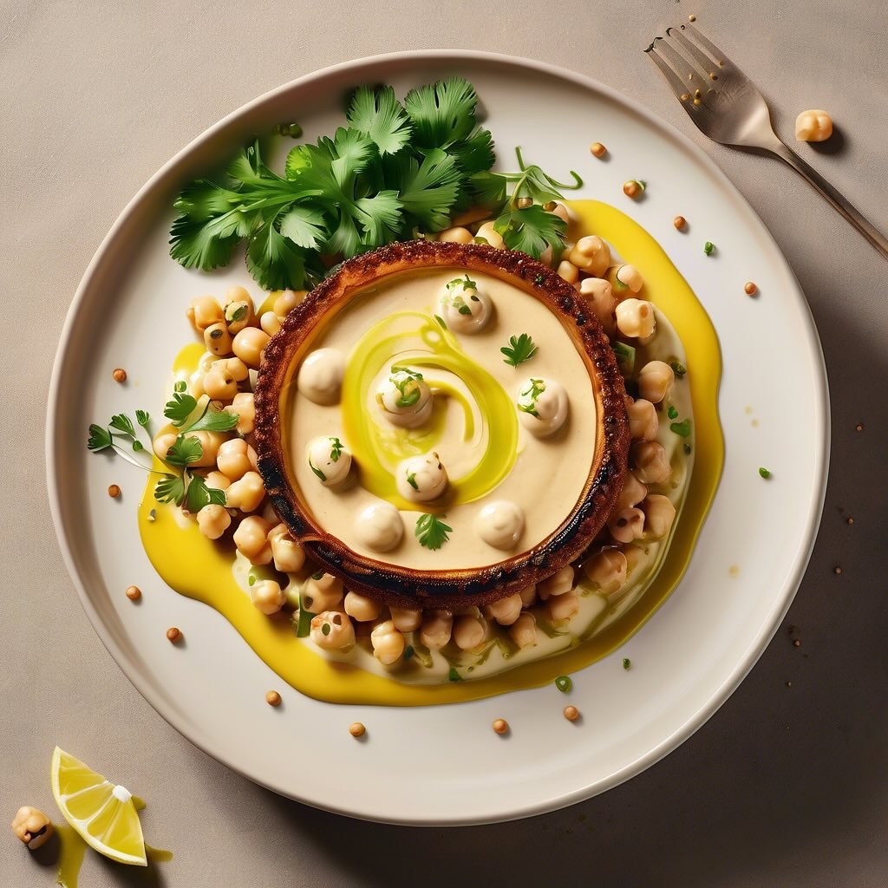

# # Ingredienti #### Per la crema di ceci: - 250 g di ceci secchi (o 400 g di ceci

# Ingredienti #### Per la crema di ceci: - 250 g di ceci secchi (o 400 g di ceci in scatola) - 1 spicchio d’aglio - 1 cipolla - 2 cucchiai di olio extravergine d’oliva - 500 ml di brodo vegetale - Succo di limone q.b. - Sale e pepe q.b. - Paprika dolce (opzionale) #### Per il polpo alla griglia: - 1 polpo di circa 800 g - 2 cucchiai di olio extravergine d’oliva - 1 spicchio d’aglio - Prezzemolo fresco tritato - Sale e pepe q.b. - Limone per servire ### Preparazione #### 1. Preparare la crema di ceci: - Se usi ceci secchi, mettili a bagno in acqua fredda per 12 ore e poi lessali in acqua salata per circa 1 ora, fino a quando sono teneri. Scola e metti da parte. - In una pentola, scalda l’olio d’oliva e soffriggi l’aglio e la cipolla tritati fino a che non diventano trasparenti. - Aggiungi i ceci lessati e il brodo vegetale. Cuoci per circa 15 minuti. - Frulla il tutto fino a ottenere una crema liscia. Se necessario, aggiungi altro brodo per raggiungere la consistenza desiderata. Regola di sale, pepe e aggiungi un po’ di succo di limone e paprika per dare sapore. #### 2. Preparare il polpo alla griglia: - Pulisci il polpo e lessalo in acqua salata per circa 40-50 minuti, fino a quando è tenero. Scola e lascia raffreddare. - Una volta raffreddato, taglia il polpo in pezzi e condiscilo con olio d’oliva, aglio tritato, sale, pepe e prezzemolo. - Scalda una griglia (o una padella grill) e griglia i pezzi di polpo per circa 3-4 minuti per lato, fino a quando sono ben dorati. ### Presentazione - In un piatto fondo, versa un po’ di crema di ceci come base. Adagia sopra i pezzi di polpo grigliato e guarnisci con un filo d’olio d’oliva e una spolverata di prezzemolo fresco. - Servi con fette di limone a lato.

---

*Ricetta da @leguminando*
