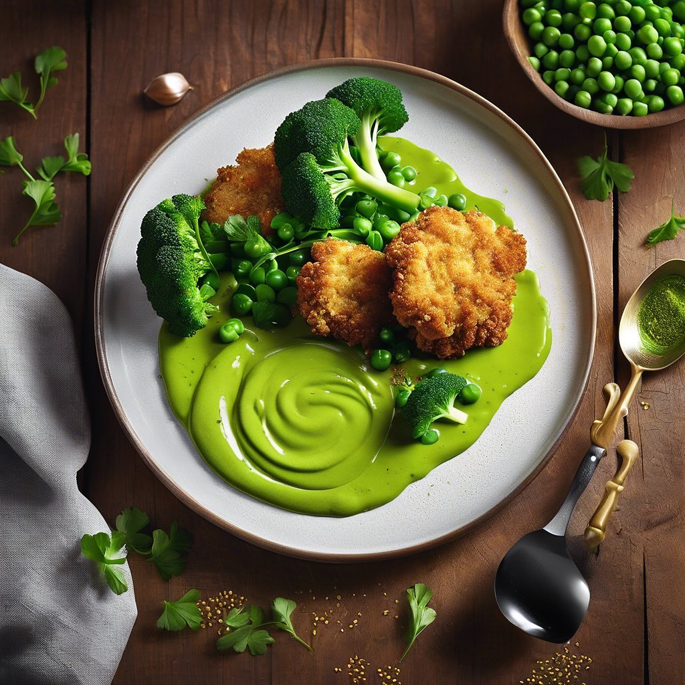

# ### Ingredienti #### Per le verdure impanate: - 250 g di broccoli - 250 g di cav

### Ingredienti #### Per le verdure impanate: - 250 g di broccoli - 250 g di cavolfiore - 100 g di farina di lenticchie &#064;alcenerobiologico - 1 uovo (o sostituto vegano) - 50 g di pangrattato (facoltativo per una croccantezza extra) - Sale e pepe q.b. - Olio d’oliva per spennellare #### Per la crema di piselli: - 200 g di piselli surgelati - 1 cipolla piccola, tritata - 1 spicchio d’aglio, tritato - 250 ml di brodo vegetale - 2 cucchiai di olio d’oliva &#064;slowfoodlivorno - Sale e pepe q.b. - Succo di limone (facoltativo, per un tocco di freschezza) ### Procedimento 1. **Preparazione delle verdure**: - Porta a ebollizione dell’acqua salata in una pentola. Cuoci i broccoli e il cavolfiore per circa 3-4 minuti, finché non sono teneri ma ancora croccanti. Scolali e raffreddali sotto acqua fredda per fermare la cottura. - In una ciotola, sbatti l’uovo con un pizzico di sale e pepe. In un’altra ciotola, versa la farina di lenticchie. Se desideri una croccantezza extra, aggiungi il pangrattato in una terza ciotola. - Passa i broccoli e il cavolfiore prima nell’uovo, poi nella farina di lenticchie e infine nel pangrattato, se utilizzato. 2. **Cottura alla griglia**: - Preriscalda la griglia o una padella antiaderente a fuoco medio-alto. Spennella le verdure impanate con un po’ d’olio d’oliva. - Cuoci i broccoli e il cavolfiore per circa 5-7 minuti per lato, finché non sono dorati e croccanti. 3. **Preparazione della crema di piselli**: - In una pentola, scalda l’olio d’oliva e soffriggi la cipolla e l’aglio fino a quando non sono trasparenti. - Aggiungi i piselli e il brodo vegetale, porta a ebollizione e cuoci per circa 5-7 minuti. - Frulla il tutto fino a ottenere una crema liscia. Aggiusta di sale e pepe e, se desideri, aggiungi un po’ di succo di limone per freschezza. 4. **Impiattamento**: - Disegna un letto di crema di piselli nel piatto. Adagia sopra i broccoli e il cavolfiore croccante.

---

*Ricetta da @leguminando*
