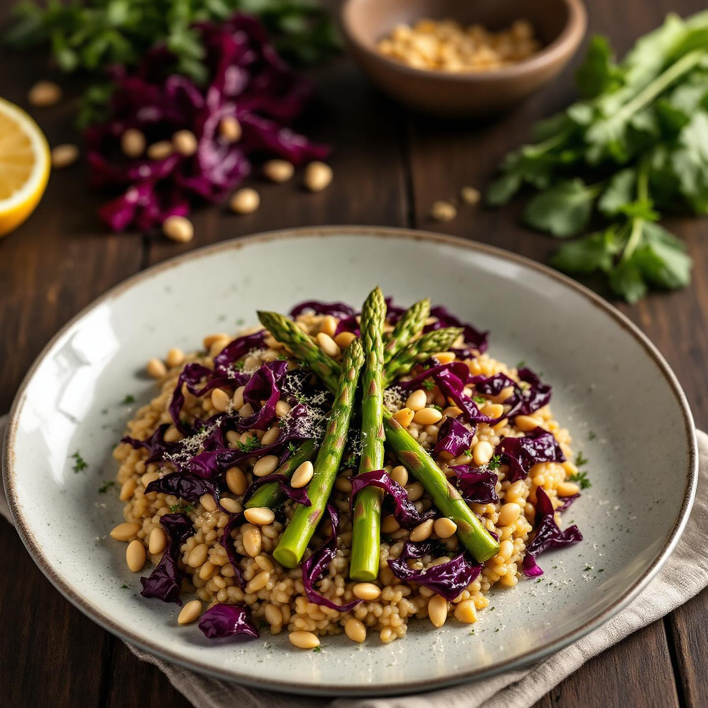

# Ingredienti per 4 persone - 320 g di riso Carnaroli - 200 g di asparagi - 150 g 

Ingredienti per 4 persone - 320 g di riso Carnaroli - 200 g di asparagi - 150 g di cavolo nero - 1 cespo medio di radicchio rosso - 100 g di piselli freschi (o surgelati di buona qualità) - 50 g di pinoli - 1 scalogno - 1 spicchio d’aglio - 1 bicchiere di vino bianco secco - 1,2 l di brodo vegetale caldo - 50 g di burro - 50 g di Parmigiano Reggiano grattugiato - la scorza di ½ limone non trattato - olio extravergine d’oliva q.b. - sale e pepe nero - un pizzico di peperoncino in fiocchi (facoltativo) Preparazione 1. Preparazione delle verdure • Elimina la parte più dura degli asparagi, tagliali in due o tre pezzi lunghi circa 3–4 cm; conserva le punte a parte. • Togli la costa centrale al cavolo nero e spezzetta le foglie in pezzi di circa 2 cm. • Affetta il radicchio a striscioline sottili. • Se usi piselli freschi, sgusciali; altrimenti sciacquali bene. 2. Sbollentatura • Porta a bollore un pentolino d’acqua salata, tuffa le punte d’asparago e i piselli, scolali dopo 2 minuti e trasferiscili in acqua fredda per fissarne il colore. • Tieni da parte il brodo vegetale ben caldo. 3. Tostatura e cottura del soffritto • In una casseruola ampia scalda 2 cucchiai di olio, unisci lo scalogno tritato e l’aglio schiacciato; fai appassire a fuoco dolce senza far colorire. • Alza leggermente la fiamma, aggiungi il cavolo nero e saltalo per 2–3 minuti, poi unisci anche il radicchio, mescola e sfuma con il vino bianco. Lascia evaporare l’alcol. 4. Cottura del risotto • Versa il riso nella casseruola e tostalo per un paio di minuti, mescolando. • Inizia ad aggiungere il brodo un mestolo alla volta, coprendo appena il riso: ogni volta che si assorbe, aggiungi il successivo. • A metà cottura (dopo circa 8–9 minuti) unisci anche gli asparagi e i piselli sbollentati. Continua a mescolare e a colmare con brodo fino a portare il riso a perfetta mantecatura (al dente, dopo circa 16–17 minuti totali).

---

*Ricetta da @leguminando*
