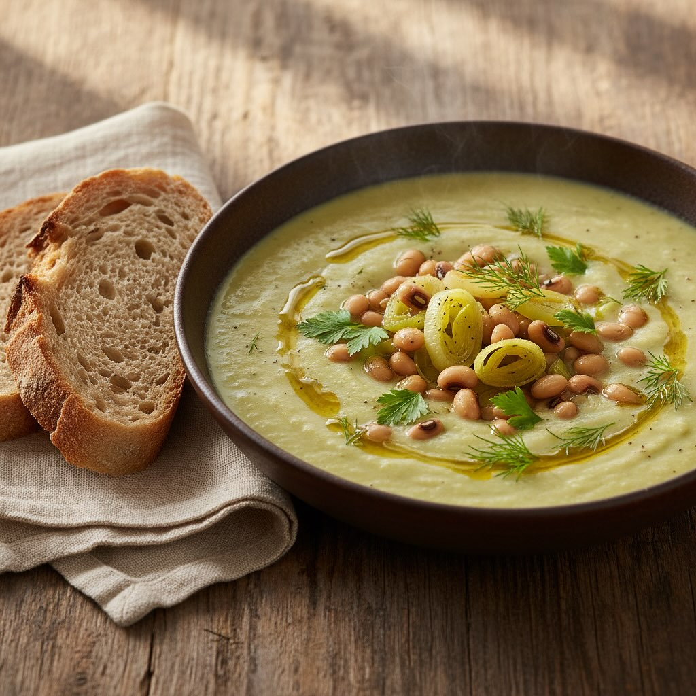

# Ingredienti per 4 persone • 2 bulbi di finocchio (circa 500 g) • 2 porri (solo p

Ingredienti per 4 persone • 2 bulbi di finocchio (circa 500 g) • 2 porri (solo parte bianca e verde chiaro) • 240 g di fagioli dall’occhio già cotti (una scatola da 400 g circa, scolati e risciacquati) • 1 cipolla media • 2 spicchi d’aglio • 700–800 ml di brodo vegetale • 100 ml di panna da cucina (opzionale per maggiore cremosità) • 3–4 cucchiai di olio extravergine d’oliva • sale e pepe nero macinato al momento • erbe aromatiche a piacere (aneto o prezzemolo per guarnire) Preparazione 1. Pulizia e taglio a) Togli le estremità e le barbe dai finocchi, elimina le coste esterne più dure e taglia a fette spesse circa 1 cm. b) Affetta la cipolla e trita gli spicchi d’aglio. c) Mondate i porri: eliminate la parte verde scura, aprite a metà, sciacquate bene tra le foglie per eliminare la terra e quindi affettate a rondelle sottili. 2. Cottura della crema di finocchi a) In una casseruola capiente scalda 2 cucchiai d’olio a fuoco medio. b) Fai soffriggere cipolla e aglio finché diventano traslucidi (3–4 minuti), senza farli colorire troppo. c) Aggiungi le fette di finocchio, mescola e lascia insaporire 5 minuti, poi copri con il brodo vegetale. d) Porta a leggero bollore, copri con un coperchio e cuoci a fiamma bassa per 15–20 minuti, finché i finocchi sono morbidissimi. 3. Preparazione di porri e fagioli a) Nel frattempo, in una padella ampia scalda 1–2 cucchiai d’olio. b) Aggiungi i porri affettati, regola di sale e pepe e cuoci a fuoco medio-basso mescolando spesso, finché diventano teneri ma non bruniti (8–10 minuti). c) Unisci i fagioli dall’occhio già cotti, scalda per 2–3 minuti, pepando a piacere, quindi tieni da parte. 4. Frullatura e finitura a) Quando i finocchi sono cotti, spegni la fiamma e frulla il tutto con un frullatore a immersione fino a ottenere una crema liscia. b) Se ti piace una consistenza ancora più vellutata, aggiungi la panna da cucina, mescola e scalda brevemente (non portare a bollore). c) Aggiusta di sale e pepe.

---

*Ricetta da @leguminando*
