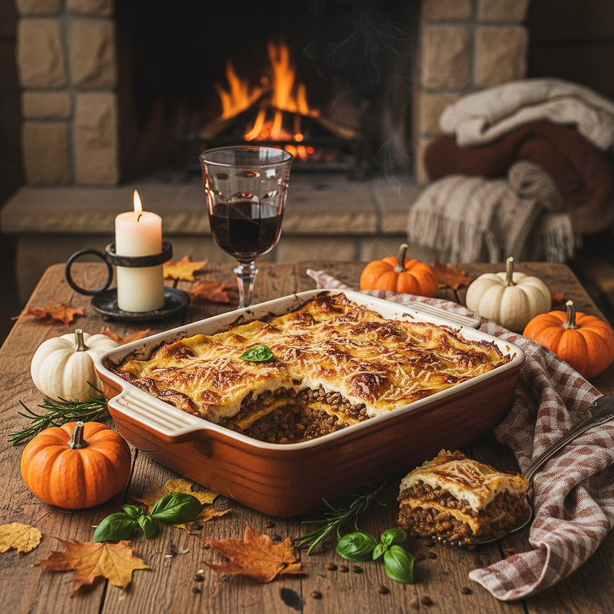

# Ingredienti (per 6–8 persone) 1) Ragù di lenticchie e porcini - 200 g di lenticc

Ingredienti (per 6–8 persone) 1) Ragù di lenticchie e porcini - 200 g di lenticchie secche (preferibilmente piccole, come le lenticchie di Colfiorito) - 30 g di funghi porcini secchi - 1 cipolla grande - 1 carota - 1 costa di sedano - 2 spicchi d’aglio - 400 g di passata di pomodoro - 100 ml di vino rosso (facoltativo) - 500 ml di brodo vegetale caldo - 4 cucchiai d’olio extravergine d’oliva - Sale, pepe, un pizzico di peperoncino in fiocchi - Una manciata di prezzemolo tritato 2) Besciamella - 50 g di burro - 50 g di farina 00 - 500 ml di latte intero (o latte vegetale se preferisci) - Un pizzico di noce moscata - Sale q.b. 3) Lasagne e montaggio - 250 g di sfoglie per lasagne (fresche o secche, secondo gusto) - 100 g di Parmigiano Reggiano grattugiato - Un filo d’olio per ungere la teglia Preparazione (versione ridotta) 1. Ammollo e cottura lenticchie Metti i porcini in acqua tiepida 20 min, scolali e conserva l’acqua filtrata. Sciacqua le lenticchie e cuocile in brodo per 20–25 min; scolale tenendo il brodo. 2. Soffritto e ragù Trita cipolla, carota, sedano e aglio. Fai appassire in olio, unisci i porcini tritati e salta 2–3 min. Sfuma col vino, poi aggiungi passata, lenticchie, un mestolo di brodo (anche dell’ammollo) e cuoci a fiamma bassa 15 min. Aggiusta di sale, pepe e peperoncino, incorpora il prezzemolo. 3. Besciamella Fondi il burro a fuoco basso, togli dal calore e unisci la farina mescolando bene. Rimetti sul fuoco, versa il latte a filo e cuoci mescolando finché si addensa; sala e profuma con noce moscata. 4. Montaggio Unghi una teglia (30×20 cm). Stendi uno strato sottile di besciamella, copri con le sfoglie, poi alterna ragù, besciamella e Parmigiano. Ripeti fino a esaurire gli ingredienti, terminando con besciamella e formaggio. 5. Cottura e riposo Scalda il forno a 180 °C (statico) e cuoci 25–30 min, finché la superficie diventa dorata. Fai riposare 10 min prima di servire.

---

*Ricetta da @leguminando*
