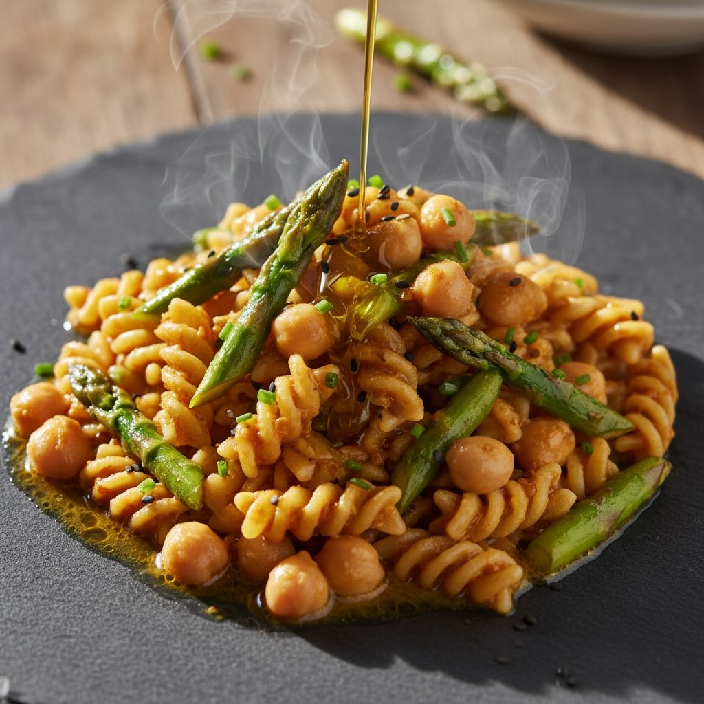

# Pasta Miso e Ceci con Asparagi Croccanti **Tempo totale**: circa 35 min (escluso

Pasta Miso e Ceci con Asparagi Croccanti **Tempo totale**: circa 35 min (escluso ammollo dei ceci) **Difficoltà**: facile‑media — **RICETTA COMPLETA** *Porzioni: 2 persone* **Ingredienti** - 120 g di pasta corta (pappardelle o fettuccine) - 150 g di ceci sgocciolati - 2 cucchiai di miso bianco - 200 g di asparagi freschi, tagliati a pezzi di circa 5 cm - 2 spicchi d’aglio, tritati finemente - 30 ml di olio extravergine d’oliva - 150 ml di brodo vegetale - Sale e pepe q.b. Ecco un riassunto senza i punti elenco: Per ammorbidire i ceci, mettili in una ciotola con un pizzico di sale per 30 minuti. Cuoci la pasta in acqua salata fino a quando è al dente, scolala e conserva mezza tazza di acqua di cottura. In una padella, scalda un cucchiaio d’olio a fuoco medio-alto, rosola l’aglio per due minuti fino a doratura, poi aggiungi gli asparagi con un po’ di sale e cuoci per 3-4 minuti finché non sono croccanti. Sciogli il miso bianco in una ciotolina con due cucchiai di brodo vegetale fino a ottenere una crema liscia. Aggiungi il miso sciolto e l’olio rimanente alla padella con gli asparagi, mescola per un minuto e incorpora i ceci ammorbiditi, aggiustando di sale e pepe. Trasferisci la pasta nella padella e mescola a fuoco medio per avvolgerla con il sugo, aggiungendo acqua di cottura se necessario. Infine, unisci gli asparagi croccanti, mescola delicatamente e servi subito. #leguminando

---

*Ricetta da @leguminando*
