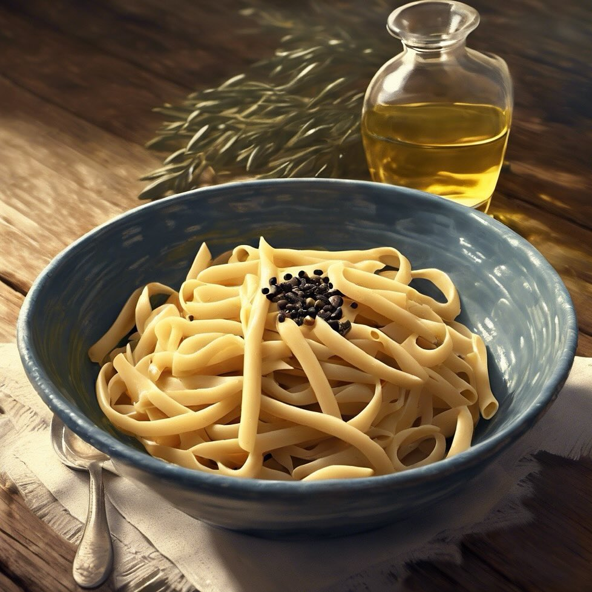

# Pasta e Fagioli **Ingredienti:** - 200g di pasta - 200g di fagioli cannellini - 

Pasta e Fagioli **Ingredienti:** - 200g di pasta - 200g di fagioli cannellini - 1 cipolla - 2 pomodori - Brodo vegetale **Preparazione:** 1. **Soffritto:** In una pentola, scalda un filo d’olio e aggiungi la cipolla tritata. Fai soffriggere fino a doratura, quindi aggiungi i pomodori tagliati. 2. **Cottura della pasta:** Aggiungi i fagioli cannellini e il brodo vegetale. Porta a ebollizione e aggiungi la pasta. Cuoci fino a quando la pasta è al dente. 3. **Condimento finale:** Aggiusta di sale e pepe. Se vuoi, puoi aggiungere un pizzico di peperoncino per un tocco piccante. 4. **Servizio:** Servi la pasta e fagioli in ciotole profonde, guarnendo con un filo d’olio d’oliva e pepe nero macinato fresco.

---

*Ricetta da @leguminando*
