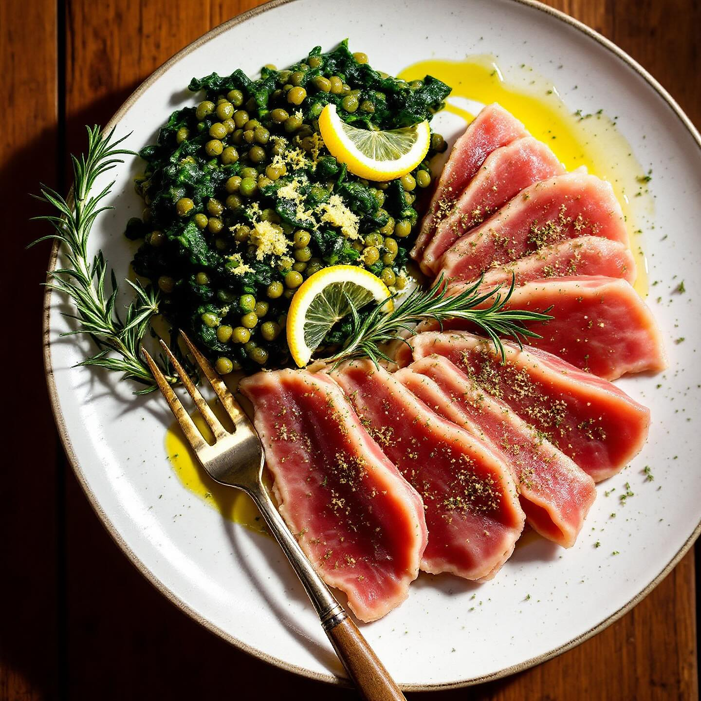

# Per il tonno “porchettato” - 800 g di filetto di tonno intero, sgrassato e ben a

Per il tonno “porchettato” - 800 g di filetto di tonno intero, sgrassato e ben asciugato - 100 g di fettine sottili di pancetta tesa (o lardo steso) - 2 cucchiai di semi di finocchio, tostati e leggermente schiacciati - 1 cucchiaio di rosmarino fresco tritato - 1 cucchiaino di timo fresco tritato - Scorza grattugiata di ½ limone - 1 spicchio d’aglio schiacciato - 1 cucchiaino di pepe nero macinato grosso - 1 cucchiaino di sale fino - 2 cucchiai di olio extravergine d’oliva Per le lenticchie al cavolo nero - 250 g di lenticchie secche (o 400 g già lessate) - 1 cipolla piccola - 1 carota - 1 gambo di sedano - 2 spicchi d’aglio - 200 g di foglie di cavolo nero, private della costa centrale e tagliate a listarelle - 700 ml di brodo vegetale caldo - 2 cucchiai di olio extravergine d’oliva - Sale e pepe q.b. Preparazione 1. Marinatura e arrotolatura del tonno a. In una ciotola unisci i semi di finocchio, rosmarino, timo, scorza di limone, aglio, pepe e sale. Mescola con l’olio fino a ottenere una pasta profumata. b. Disponi il filetto di tonno su un tagliere, spennellalo con metà della pasta di spezie. c. Appoggia le fettine di pancetta a velare uniformemente il filetto. Massaggia con il resto della miscela di spezie, assicurandoti che penetri bene tra le pieghe della pancetta. d. Arrotola il tonno nel senso della lunghezza formando un cilindro ben compatto; legalo con spago da cucina a intervalli di 2–3 cm. 2. Cottura del tonno a. Preriscalda il forno a 160 °C (statico). b. Ungi leggermente una teglia antiaderente o copri con carta forno. Sistema il cilindro di tonno e cuoci per circa 20–25 minuti—il centro dovrà raggiungere i 48–50 °C per mantenersi rosa e succoso. c. Sforna, copri con un foglio di alluminio e lascia riposare 5 minuti: così i succhi si ridistribuiranno.

---

*Ricetta da @leguminando*
