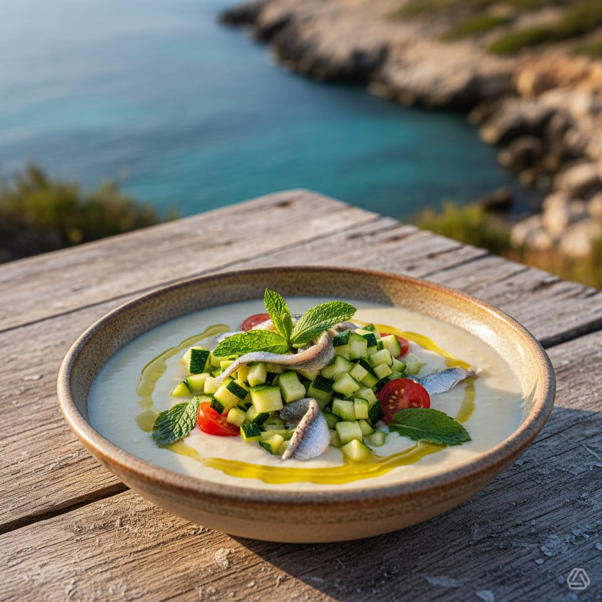

# Ricetta **Crema di Ceci Fredda:** - 400 g di ceci precotti - 200 ml di acqua o b

Ricetta **Crema di Ceci Fredda:** - 400 g di ceci precotti - 200 ml di acqua o brodo vegetale - 10 foglie di menta, 8 di basilico - 3 cucchiai di olio EVO, 2 di succo di limone - Sale e pepe a piacere **Zucchine Crude:** - 2 zucchine piccole (circa 300 g) - 1 cucchiaio di olio EVO, 1 di succo di limone - Sale q.b. **Alici Marinate:** - 80 g di filetti di alici sott’olio - 1 cucchiaio di succo di limone, 1/2 cucchiaino di scorza di limone - Pepe nero e 1 cucchiaio di olio EVO **Guarnizione:** - 150 g di pomodorini rossi e gialli a metà - Menta fresca, scorza di limone, olio a crudo, pepe nero - Crostini (opzionale) Preparazione **Alici Marinate:** - Scolare e disporre le alici in un piatto. - Aggiungere succo e scorza di limone, pepe e marinare 10 minuti. - Condire con olio EVO. **Crema di Ceci Fredda:** - Risciacquare i ceci e frullare con acqua, menta, basilico, olio EVO, limone, sale e pepe. - Ottenere una consistenza vellutata e raffreddare in frigo. **Zucchine Crude:** - Lavare e tagliare le zucchine a dadini. - Condire con olio EVO, limone e sale. **Assemblaggio:** - Versare la crema di ceci nelle ciotole. - Aggiungere zucchine e alici. - Decorare con pomodorini, menta, scorza di limone, olio e pepe #leguminando

---

*Ricetta da @leguminando*
