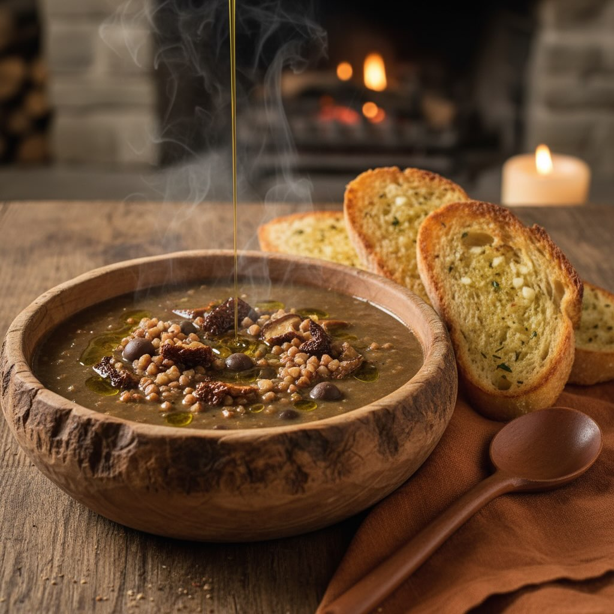

# ### Ricetta della Zuppa di Roveja e Funghi Porcini **Ingredienti Principali:** -

### Ricetta della Zuppa di Roveja e Funghi Porcini **Ingredienti Principali:** - **Roveja secca:** 300 g, ammollo di 8 ore. - **Porcini freschi:** 400-500 g, affettati. - **Funghi porcini secchi (opzionali):** 30 g, ammollo di 20 minuti. - **Porri:** 2 medi, affettati. - **Passato di pomodori:** 400 g. - **Brodo vegetale:** 1,5-2 L. - **Olio EVO:** 4 cucchiai. - **Vino bianco secco:** 150 ml. - **Aglio:** 2 spicchi. - **Rosmarino fresco:** 1 rametto. - **Burro (facoltativo):** 1 cucchiaio. **Pane all’Aglio:** - 4 fette di pane rustico. - Olio EVO e aglio per insaporire. ## Procedimento 1. **Preparazione Roveja:** - Sciacqua e metti in ammollo per 8 ore. Scola e risciacqua. 2. **Preparazione Funghi:** - *Freschi:* Puliscili e affettali. - *Secchi:* Scola, strizza e affetta, conservando l&#039;’cqua di ammollo. 3. **Cottura Roveja:** - Cuoci in acqua con sale e bicarbonato per 45-60 minuti. 4. **Soffritto Aromatico:** - Cuoci porri in olio, aggiungi aglio e rosmarino. 5. **Sfumare e Aggiungere Pomodoro:** - Aggiungi vino, lascia evaporare, poi incorpora il passato di pomodoro. 6. **Unire Funghi e Brodo:** - Aggiungi funghi e brodo, porta a ebollizione. 7. **Incorporare Roveja:** - Aggiungi la roveja cotta, sobbollire per 15-20 minuti. 8. **Mantecare (Facoltativo):** - Aggiungi burro e ulteriore olio per cremosità. 9. **Preparare Pane all&#039;’glio:** - Tosta il pane con olio e strofinalo con aglio. 10. **Servire:** - Servi la zuppa calda con pane all&#039;’glio, decorando con pepe e rosmarino.

---

*Ricetta da @leguminando*
