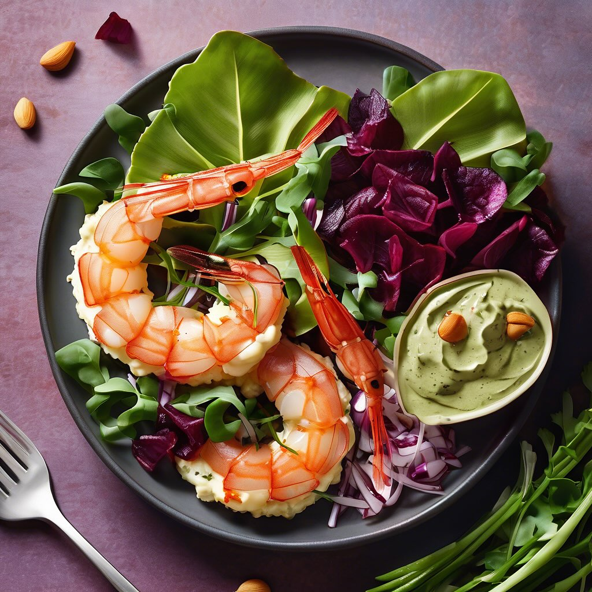

# ### Ricetta per Antipasto a Base di Crema di Ceci, Cavolfiore, Zucca e Olive Tag

### Ricetta per Antipasto a Base di Crema di Ceci, Cavolfiore, Zucca e Olive Taggiasche #### Ingredienti: - 200 g di ceci (cotti o in scatola) - 200 g di cavolfiore - 200 g di zucca - 50 g di olive Taggiasche - 2 cucchiai di olio d’oliva - 1 spicchio d’aglio - Sale e pepe q.b. - Paprica dolce (opzionale) - Erbe fresche (prezzemolo o basilico) per guarnire #### Preparazione: 1. **Preparazione degli ingredienti**: - Se usi ceci secchi, mettili a bagno per una notte e cuocili secondo le istruzioni. Se usi ceci in scatola, scolali e risciacquali. - Lava e pulisci il cavolfiore, tagliandolo in piccoli pezzi. Fai lo stesso con la zucca, rimuovendo la buccia e i semi. 2. **Cottura del cavolfiore e della zucca**: - In una pentola, porta a ebollizione dell’acqua salata. Aggiungi il cavolfiore e la zucca e cuoci per circa 10-15 minuti, finché non sono teneri. - Scola le verdure e mettile da parte. 3. **Preparazione della crema di ceci**: - In un frullatore, aggiungi i ceci cotti, l’aglio, un cucchiaio di olio d’oliva, sale, pepe e un po’ d’acqua (se necessario) per ottenere una consistenza cremosa. Frulla fino ad ottenere una crema liscia. 4. **Assemblaggio del piatto**: - In un piatto da portata, stendi un generoso strato di crema di ceci. Sopra, disponi i pezzi di cavolfiore e zucca. - Aggiungi le olive Taggiasche e guarnisci con erbe fresche. Se desideri, spolverizza con un po’ di paprica dolce per un tocco in più. 5. **Servire**: - Servi l’antipasto a temperatura ambiente o leggermente tiepido, accompagnato da crostini di pane o crackers.

---

*Ricetta da @leguminando*
