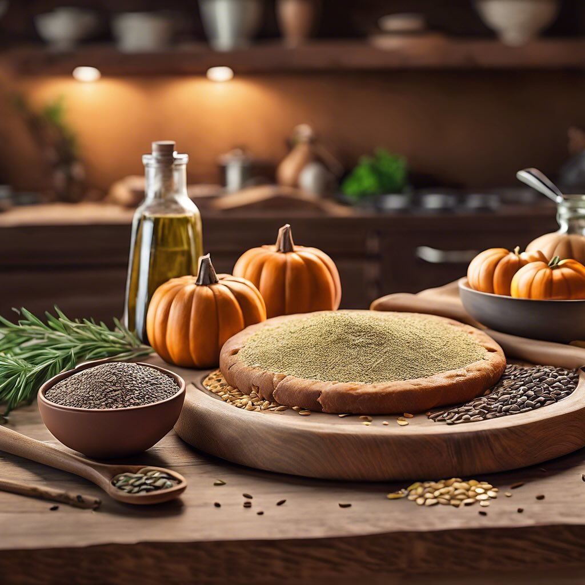

# ### Schiacciata con Farina di Carrube e Semi #### Ingredienti: - 200 g di farina

### Schiacciata con Farina di Carrube e Semi #### Ingredienti: - 200 g di farina di carrube - 50 g di olio d’oliva - 100 ml di acqua tiepida - 2 cucchiai di semi di chia - 50 g di semi di girasole - 30 g di pinoli - 30 g di semi di lino - 50 g di semi di zucca - 1 cucchiaino di sale - 1 cucchiaino di lievito in polvere (opzionale, per una consistenza più soffice) - Erbe aromatiche a piacere (rosmarino o origano, facoltativo) #### Procedimento: 1. **Preparazione dei Semi di Chia**: In una ciotola, mescolare i semi di chia con 6 cucchiai di acqua e lasciare riposare per circa 15 minuti, fino a quando non si forma un gel. 2. **Mescolare gli Ingredienti Secchi**: In una grande ciotola, unire la farina di carrube, il sale e il lievito in polvere (se usato). Mescolare bene. 3. **Aggiungere gli Ingredienti Liquidi**: Aggiungere l’olio d’oliva, il gel di semi di chia e l’acqua tiepida agli ingredienti secchi. Mescolare fino a ottenere un impasto omogeneo. 4. **Incorporare i Semi**: Aggiungere i semi di girasole, pinoli, semi di lino e semi di zucca all’impasto. Mescolare bene fino a distribuirli uniformemente. 5. **Formare la Schiacciata**: Preriscaldare il forno a 180°C. Rivestire una teglia con carta da forno e versare l’impasto, livellandolo con le mani o una spatola fino a ottenere uno spessore di circa 1-2 cm. Se desiderato, spolverare con erbe aromatiche. 6. **Cottura**: Cuocere in forno per circa 25-30 minuti, o fino a quando la schiacciata è dorata e cotta. 7. **Raffreddamento**: Sfornare e lasciare raffreddare su una griglia prima di tagliare e servire. ### Suggerimenti: - Puoi servirla calda o a temperatura ambiente. - È perfetta come spuntino, antipasto o accompagnamento a zuppe e insalate.

---

*Ricetta da @leguminando*
